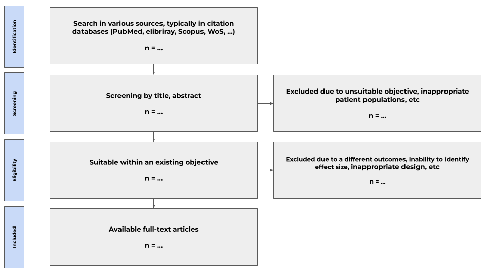
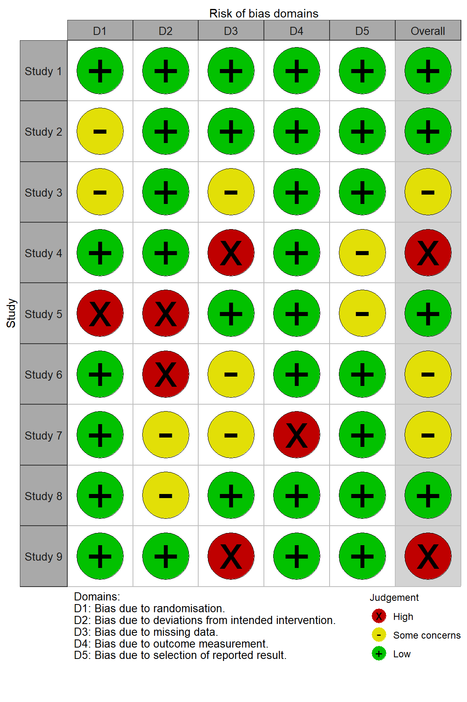
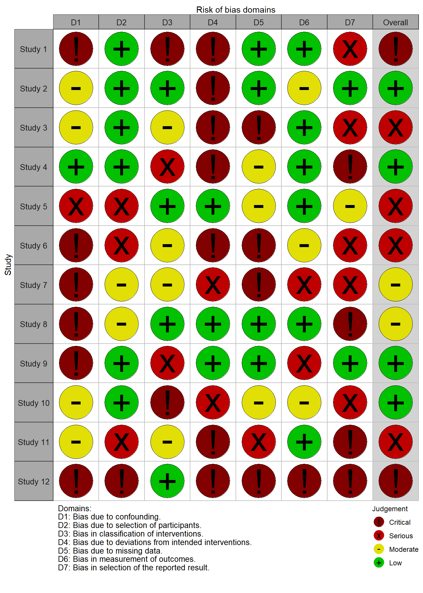
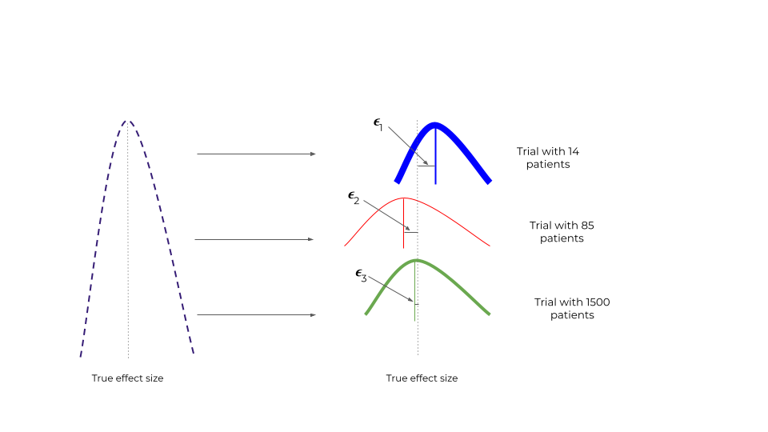
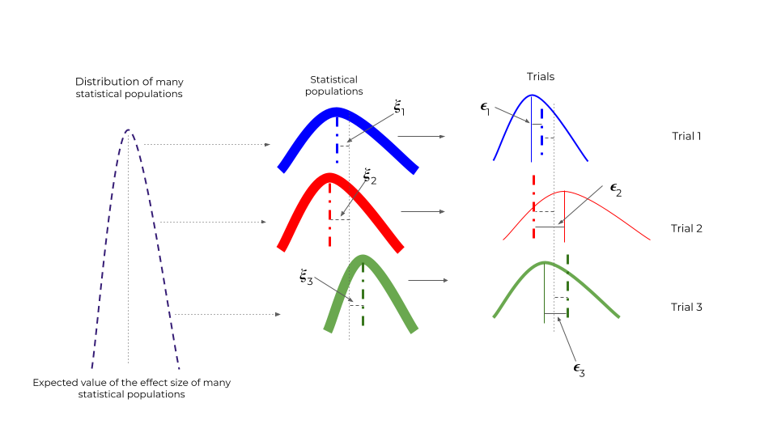
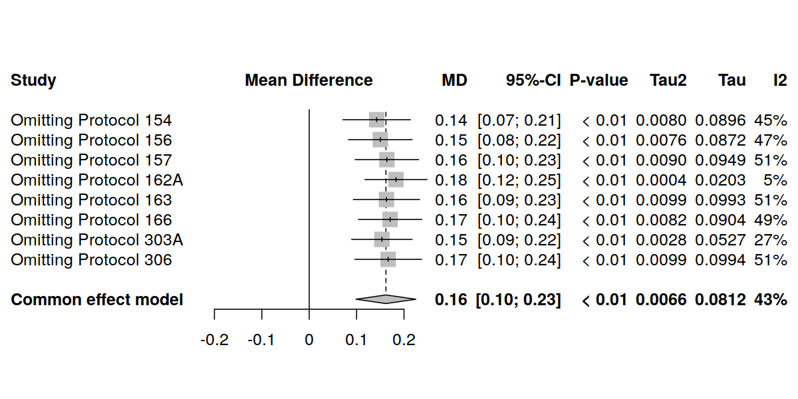
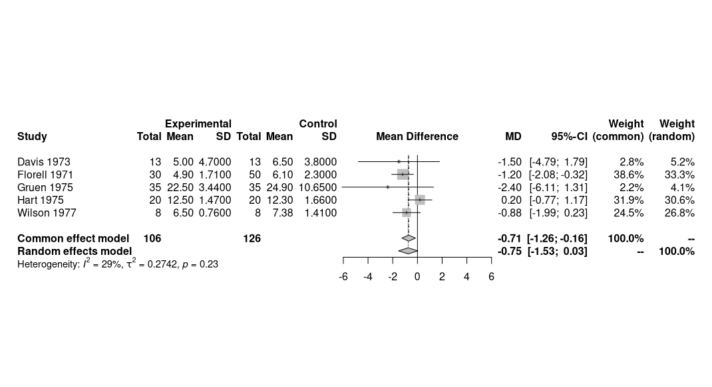

---
output:
  html_document: default
  pdf_document: default
  word_document: default
---

<!-- Graphics from https://docs.google.com/presentation/d/1rAcCuietHzjIvflFLC9I8VthZ5uozTowefzN6Pd1oec/edit#slide=id.g1a4b64647ba_0_0 -->

# Introduction to meta-analysis

  

- [Introduction to meta-analysis](#introduction-to-meta-analysis)
  - [What are meta-analysis?](#what-are-meta-analysis)
  - [Inclusion of studies in meta-analysis and methodological framework](#inclusion-of-studies-in-meta-analysis-and-methodological-framework)
    - [PRISMA guidelines](#prisma-guidelines)
  - [Estimation of possible biases in publications](#estimation-of-possible-biases-in-publications)
  - [Effect size in meta-analysis](#effect-size-in-meta-analysis)
    - [Fixed and random effects models](#fixed-and-random-effects-models)
      - [Fixed effects model](#fixed-effects-model)
      - [Model with random effects](#model-with-random-effects)
  - [Assessing heterogeneity](#assessing-heterogeneity)
    - [Ways to assess heterogeneity](#ways-to-assess-heterogeneity)
      - [Cochran's $Q$](#cochrans-q)
      - [$I^2$ - Higgins and Thompson statistics](#i2---higgins-and-thompson-statistics)
      - [$H^2$ - statistics](#h2---statistics)
      - [Variance of heterogeneity $\\tau^2$](#variance-of-heterogeneity-tau2)
  - [Sensitivity analysis](#sensitivity-analysis)
  - [Forest Plot](#forest-plot)
- [Conclusion](#conclusion)
- [References](#references)

## What are meta-analysis?

<!-- https://www.ncbi.nlm.nih.gov/pmc/articles/PMC3049418/  -->

<!-- Многие оригинальные исследования имеют сходные цели и задачи, но при этом проводятся разными коллективами, с разными пациентами, по иным протоколам и в разные временные промежутки. Результаты таких исследований могут быть разнообразны ии противоречивы, что затрудняет принятие клинических решений. Благодаря концепции доказательной медицины разработаны инструменты, позволяющие объединить результаты многочисленных исследований, в определенной мере различающихся между собой [^Sackett]. Проверяя гипотезы в разных популяциях мы получаем бесценные данные о том, что а) эффект прослеживается у разных групп (или, наоборот, есть только в конкретных группах) б) получаем информацию о вариабельности эффекта. Большое количество сходных исследований, по сути, являются репликациями одного большого эксперимента. Соответствено, большее количество репликаций повышает мощность и степень доверия к результатам. -->

Many original studies follow similar goals and objectives, but are carried out by different teams, with different patients, according to different protocols and at different time intervals. The results of such studies can be varied and inconsistent, making it difficult to make clinical decisions. Thanks to the concept of evidence-based medicine, tools have been developed to combine the results of numerous studies that differ to a certain extent [^ Sackett]. By testing hypotheses in different populations, we obtain invaluable data that a) the effect can be traced in different groups (or, conversely, it exists only in specific groups) b) we obtain information about the variability of the effect. A large number of similar studies are, in fact, replications of one large experiment. Accordingly, more replications increase the power and confidence in the results.

<!-- Существуют несколько основных инструментов суждения о совокупных результатах неких единообразных исследований: -->

There are several main tools for judging the cumulative results of some uniform studies:

<!-- - **Систематические обзоры**. Систематические обзоры включают все исследования, которые возможно найти, соответствующие неким строгим критериям включения. Данные критерии включения направлены на соблюдение ряда стандартов, предъявляемых к планированию исследований, проведению и стандартным операционным процедурам и результатам (например, исследования по артериальной гипертензии, где артериальное давление оценивалось в соответствии с международными рекомендациями по кардиологии; исследования определенной манипуляции в хирургии, которая выполнялась строго в соответствии с четкими рекомендациями международных ассоциаций). 

- **Метаанализы**. Главным отличием метаанализа от систематических обзоров является не только рассмотрение результатов ряда исследований, но и попытка количественной оценки их результатов. В самом деле, нам необходимо знать не только то, что препарат/вмешательство обладает эффектом, но и оценить размер этого эффекта, и широту его вариабельности.

В настоящей публикации мы затронем базовые аспекты проведения мета-анализов, что делается после того, как проведен литературный поиск, и, фактически, проведена большая часть работы касательно систематического обзора.  -->

- **Systematic reviews**. Systematic reviews include all studies that can be found that meet some strict inclusion criteria. These inclusion criteria aim to meet a set of standards for study design, conduct, and standard operating procedures and outcomes (e.g., studies on hypertension, where blood pressure was assessed according to international guidelines for cardiology; studies on a particular procedure in surgery, which was performed strictly in accordance with the clear recommendations of international associations).

- **Meta-analyzes**. The main difference between meta-analysis and systematic reviews is not only the consideration of the results of a number of studies, but also an attempt to quantify their results. Indeed, we need to know not only that a drug/intervention has an effect, but also to estimate the size of that effect and the breadth of its variability.

In this publication, we will focus on the basic concepts of conducting meta-analyses, which is done after a literature search has been carried out, and, in fact, most of the work regarding a systematic review has been done.

<!-- ## Включение исследований в мета-анализ и методологические основы

### Рекомендации PRISMA

Детальное описание критериев и процесса литературного поиска не является темой настоящей публикации, однако важно помнить, что любой создание систематического обзора проходит из ряда ступеней. Эти ступени объединены в стандартную схему, получившую название диаграмма PRISMA, по названию соответствующих рекомендаций [^PRISMA]. 

Шаблон диаграммы PRISMA, адаптировано из Page et al.[^PRISMA] -->

## Inclusion of studies in meta-analysis and methodological framework

### PRISMA guidelines

A detailed description of the criteria and process of a literature search is beyond the scope of this publication, but it is important to remember that any systematic review has a number of steps. These steps are combined into a standard scheme, called the PRISMA diagram, after the name of the corresponding guidelines [^PRISMA].

PRISMA flowchart template, adapted from Page et al.[^PRISMA]

<!-- Собственно, мета-анализ начинается после тоого, кк завершено включение и доступны исследования, из которых будет выполнена экстракция данных. 

Основными рекомендациями по предварительным и дальнейшим шагам, представляющие для читателя практический интерес, являются:

- Руководство Кокрановского общества по составлению систематических обзоров (Cochrane Handbook for Systematic Reviews of Interventions) [^Cochrane] - данный документ размещен в интернете и представляет собой структурированное руководство с освещением практически всех аспектов литературного поиска, проведения мета-анализа, базовых навыков по математической статистике, необходимых для такой работы;

- Рекомендации PRISMA, о которых мы упоминали выше (Preferred Reporting Items for Systematic Reviews and Meta-Analyses (PRISMA)) [^PRISMA];

Представленные рекомендации помогут соблюсти высокие стандарты при написании систематических обзоров и снизить число возможных ошибок и неточностей, которые впоследствии могут затруднить продолжение работы. В связи с тем, что мета-анализы широко используются фармацевтическими компаниями, а также иными коммерческими структурами, соблюдение указанных в рекомендациях стандартов проверяется очень строго и тщательно при рассмотрении ревьюерами, а также при публикации. Строгое выполнение регламента рекомендаций является залогом успешной публикации.  -->

Actually, meta-analysis begins after inclusion is completed and studies are available from which data will be extracted.

The main recommendations for preliminary and further steps of practical interest to the reader are:

- Cochrane Handbook for Systematic Reviews of Interventions [^Cochrane] - this document is available online and is a structured guide covering almost all aspects of literature search, meta-analysis, basic skills in mathematical statistics necessary for such work;

- The PRISMA recommendations we mentioned above (Preferred Reporting Items for Systematic Reviews and Meta-Analyses (PRISMA)) [^PRISMA];

The recommendations presented will help to maintain high standards when writing systematic reviews and reduce the number of possible errors and inaccuracies that can subsequently make it difficult to continue work. Due to the fact that meta-analyses are widely used by pharmaceutical companies, as well as other commercial structures, compliance with the standards specified in the recommendations is checked very strictly and carefully when reviewed by reviewers, as well as during publication. Strict adherence to the rules of recommendations is the key to successful publication.

<!-- ## Оценка возможных смещений в публикациях

После осбора всех подходящих публикаций для включения необходимо оценить их с точки зрения возможных смещений. К сожалению, источников потенциальных смещений может быть довольно много, поэтому были разработаны специальные инструменты, позволяющие исследователям проводить потенциальную оценку публикаций. Такие инструменты получили название *графики риска смещений* или risk of bias plots.

Данные графики возможно построить для исследований различных типов дизайна, в первую очередь для рандомизированных контролируемых исследований (РКИ) и для нерандомизированных исследований (неРКИ) [^robvis] [^robins]. Графики, приведенные ниже, получили названия "светофоры". Основная идея сводится к тому, что исследователи, проводящие мета-аннализ, рассматривают каждое исследование по отдельности и оценивают, насколько велики риски, ассоциированные с:

- рандомизацией,
- вмешательством,
- пропущенными данными,
- оценкой конечной точки,
- предоставлением результатов

в РКИ.  -->

## Estimation of possible biases in publications

Once all eligible publications have been collected for inclusion, they should be assessed for potential bias. Unfortunately, there can be quite a few sources of potential bias, so special tools have been developed to allow researchers to make potential assessments of publications. Such tools are called *risk bias plots* or risk of bias plots.

These graphs can be drawn for studies of various types of design, primarily for randomized controlled trials (RCTs) and for non-randomized trials (non-RCTs) [^robvis] [^robins]. The graphs below are called "traffic lights". The main idea is that meta-analysis researchers look at each study individually and assess how great the risks are associated with:

- randomization,
- intervention,
- missing data
- evaluation of the end point,
- providing results

<!-- *- *График адаптирован из McGuinness и соавт.[^robvis_R_lib]*

В случае, если исследования не являлись РКИ оцениваются риски, связанные с:

- конфаундингом,
- отбором и включением пациентов,
- вмешательством,
- расхождением с протоколом, 
- пропущенными данными,
- оценкой конечной точки,
- предоставлением результатов. -->

*- *Graph adapted from McGuinness et al.[^robvis_R_lib]*

If the studies were not RCTs, the risks associated with:

- confounding,
- selection and inclusion of patients,
- intervention,
- discrepancy with the protocol,
- missing data
- evaluation of the end point,
- providing results.

<!-- *- *График адаптирован из McGuinness и соавт.[^robvis_R_lib]*

Оценка риска интерпретируется как потенциально "назкая", "умеренная", "высокая" и "очень высокая". 

Данный инструмент позволяет критически подходить к полученным в мета-анализе результатам и рассматривать исследования с высоким риском смещения, как менее надежные. 

Детальное описание возможностей данного инструмента приведено на сайте https://www.riskofbias.info/.  -->

*- *Chart adapted from McGuinness et al.[^robvis_R_lib]*

The risk score is interpreted as potentially "low", "moderate", "high" and "very high".

This tool allows you to critically approach the results obtained in the meta-analysis and consider studies with a high risk of bias as less reliable.

A detailed description of the capabilities of this tool is available at https://www.riskofbias.info/.

<!-- ## Размер эффекта в мета-анализе

Исследования, объединенные в мета-анализе обычно оценивают результаты по идентичной конечной точке. Данная оценка есть эффект, который был достигнут, или *наблюдаемый эффект*. Эффект традиционно обозначается греческой буквой "тета" $\theta$, наблюдаемый эффект по каждому из *k* исследований обычно обозначается, как $\theta_k$. Мы уже касались понятия эффекта и его оценки, размера эффекта, в публикации о тестировании статистических гипотез [^stat_test].

Существуют две основных концепции, позволяющие описать и оценить эффект нескольких исследований. Обе эти концепции привязаны к соответствующим статистическим моделям, с *фиксированными* и со *случайными* эффектами. 

### Модели с фиксированными и случайными эффектами

#### Модель с фиксированными эффектами -->

## Effect size in meta-analysis

Studies pooled in a meta-analysis usually evaluate outcomes at an identical end point. This score is the effect that has been achieved, or the *observed effect*. The effect is traditionally denoted by the Greek letter "theta" $\theta$, the observed effect for each of the *k* studies is usually denoted as $\theta_k$. We have already touched on the concept of effect and its estimation, effect size, in the publication on testing statistical hypotheses [^stat_test].

There are two main concepts to describe and evaluate the effect of multiple studies. Both of these concepts are tied to their respective statistical models, with *fixed* and *random* effects.

### Fixed and random effects models

#### Fixed effects model

<!-- Иллюстрации отсюда: https://docs.google.com/presentation/d/1rAcCuietHzjIvflFLC9I8VthZ5uozTowefzN6Pd1oec/edit?usp=sharing -->

<!-- **Модель с фиксированными эффектами** подразумевает, что включенные в мета-анализ исследования очень похожи друг на друга в отношении исследователей, дизайна, количества пациентов, методологии проведения, оценки результатов и т.д. Исследования представляются сходными настолько, что их результаты, или эффекты $\theta_{1,2,3,...k}$ считают единой выборкой из одной генеральной совокупности всех возможных аналогичных исследований. 

Вероятностное распределение такой совокупности имеет математическое ожидание (среднее взвешенное по вероятностям возможных значений), представляющее собой некий *истинный размер эффекта* $\hat{\theta}$. Соответственно, каждое исследование представляет собой элемент совокупности, а несколько случайно взятых из такого распределения исследований (мета-анализ) представляют собой банальную выборку. 

Наблюдаемый эффект в каждом исследовании *k* будет отличаться от истинного на величину ошибки: -->

The **Fixed effects model** implies that the studies included in the meta-analysis are very similar to each other in terms of investigators, design, number of patients, methodology, results, etc. The studies seem to be so similar that their results, or the effects of $\theta_{1,2,3,...k}$, are considered to be a single sample from one general set of all possible similar studies.

The probability distribution of such a population has a mathematical expectation (weighted average over the probabilities of possible values), which is a certain *true effect size* $\hat{\theta}$. Accordingly, each study is an element of the population, and several studies randomly taken from such a distribution (meta-analysis) represent a banal sample.

The observed effect in each study *k* will differ from the true effect by the amount of error:

$$
\begin{equation}
\hat{\theta} = \theta_k + \epsilon_k
\end{equation}
$$

<!-- Соответственно, мы  считаем, что среди нескольких исследований наиболее точными являются те, где величина выборочной ошибки $\epsilon$ наименьшая.  -->

Accordingly, we believe that among several studies, the most accurate are those where the $\epsilon$ sampling error is the smallest.

<!-- Выборка из нескольких исследований $\{1,2,3,... k\}$ должна иметь некую центральную тенденцию или математическое ожидание, отражающее истинный размер эффекта. Таким образом, используя определение математического ожидания, как среднее взвешенное, получаем: -->

A sample of multiple studies $\{1,2,3,... k\}$ should have some central trend or mean that reflects the true size of the effect. Thus, using the definition of mathematical expectation as a weighted average, we get:

$$
\begin{equation}
\hat{\theta} = \frac{w_1 \theta_1 + w_2 \theta_2 + w_3 \theta_1  + ... + w_k \theta_k}{w_1 + w_2  + w_3  + ... + w_k}
\end{equation}
$$

, where

<!-- - $\hat{\theta}$ - взвешенный размер эффекта по *k* исследованиям, являющийся результатом мета-анализа;
- $\theta_k$ - наблюдаемый эффект исследования *k*;
- $w_k$ - вес исследования *k*.

Из данного уравнения неясным остается, как получить вес каждого исследования. 

Как мы знаем, наблюдаемый эффект, полученный в исследовании *k* является точечной оценкой (в англ. литературе - point estimate). В исследовании *k* включено определенное количество пациентов, *n*. Мерой вариабельности эффекта $\theta_k$ будет его стандартная ошибка, рассчитанная как: -->

- $\hat{\theta}$ is the weighted effect size for *k* studies resulting from the meta-analysis;
- $\theta_k$ - observed research effect *k*;
- $w_k$ - research weight *k*.

From this equation, it is not clear how to get the weight of each study.

As we know, the observed effect obtained in the *k* study is a point estimate (in the English literature - point estimate). The study *k* included a certain number of patients, *n*. The measure of the variability of the $\theta_k$ effect will be its standard error, calculated as:

$$
\begin{equation}
s_k = \frac{\sigma_k}{\sqrt{n}},
\end{equation}
$$

<!-- , где 

- $\sigma$ - стандартное отклонение эффекта $\theta_k$ в исследовании *k*;
- $n$ - количество пациентов в исследовании *k*.

В модели с фиксированными эффектами один из способов расчета весов выполняется с помощью т.н. метода обратной дисперсии (inverse variance method): -->

, where

- $\sigma$ - standard deviation of the $\theta_k$ effect in the study *k*;
- $n$ - number of patients in the study *k*.

In the fixed effects model, one of the ways to calculate the weights is done using the so-called. inverse variance method:

$$
\begin{equation}
w_k = \frac{1}{s^2_k}
\end{equation}
$$

<!-- , где 

- $s^2_k$ - квадрат стандартной ошибки эффекта $\theta_k$ в исследовании  в исследовании *k*;
- $w_k$ - вес исследования *k*.

Таким образом, в модели с фиксированными эффектами вес любого исследования обратно связан с величиной обратной ошибки эффекта в исследовании и напрямую - с количеством включенных в исследование пациентов. Допущением модели является тот факт, что ничто, кроме количества пациентов не может влиять на вес исследования. 

Данная концепция, с одной стороны, представляется излишне упрощенной. В реальном мире исследования так или иначе отличаются друг от друга, и данные различия обусловлены огромным количеством факторов помимо размера выборки. 

#### Модель со случайными эффектами

Если в мета-анализе объединены исследования различного дизайна (РКИ, когортные и т.п.), проведенные в разные годы, в разных странах, в центрах с разными стандартами оказания медицинской помощи, с протоколами интервенции по разным клиническим рекомендациям, требуется модель, которая будет учитывать не только различия по объему выборки, но и по вышеупомянутым факторам. 

Такая модель предполагает, что эффект по каждому исследованию, включенному в метаанализ, является выборкой из собственной совокупности размеров эффекта и отличается от математического ожидания собственной совокупности на величину $\epsilon_k$. 

Если мы включили в мета-анализ *k* исследований, следовательно это *k* выборок из *k* различных генеральных совокупностей. При этом *k* совокупностей имеют свое распределение с математическим ожиданием в виде взвешенного размера эффекта, при этом каждая генеральная совокупность отличается от математического ожидания своего распределения на величину $\xi_k$. Такое общее распределение имеет точечную оценку, которая соответствует взвешенному эффекту в мета-анализе, $\hat{\theta}$, и дисперсию $\tau^2$. 

Схематично это можно представить следующим образом: -->

, where

- $s^2_k$ - squared standard error of $\theta_k$ effect in study in study *k*;
- $w_k$ - research weight *k*.

Thus, in a fixed effects model, the weight of any study is inversely related to the size of the inverse effect error in the study and directly to the number of patients included in the study. The assumption of the model is that nothing but the number of patients can influence the weight of the study.

On the one hand, this concept seems to be oversimplified. In the real world, studies differ in one way or another, and these differences are due to a huge number of factors in addition to sample size.

#### Model with random effects

If a meta-analysis combines studies of different designs (RCTs, cohorts, etc.) conducted in different years, in different countries, in centers with different standards of care, with intervention protocols according to different clinical guidelines, a model is required that will take into account not only differences in sample size, but also in the above factors.

This model assumes that the effect for each study included in the meta-analysis is a sample of its own population of effect sizes and differs from its own population expectation by $\epsilon_k$.

If we included *k* studies in the meta-analysis, then these are *k* samples from *k* different populations. At the same time, *k* populations have their own distribution with the expectation in the form of a weighted effect size, and each population differs from the mathematical expectation of its distribution by $\xi_k$. This overall distribution has a point estimate that corresponds to the weighted effect in the meta-analysis, $\hat{\theta}$, and a variance of $\tau^2$.

Schematically, this can be represented as follows:

<!-- Таким образом, точечная оценка эффекта в каждом исследовании среди *k* отличается от взвешенного эффекта следующим образом: -->

Thus, the point estimate of the effect in each study among *k* differs from the weighted effect as follows:

$$
\begin{equation}
\hat{\theta} = \theta_k + \epsilon_k + \xi_k
\end{equation}
$$

<!-- Показатель $\xi_k$ объединяет различия, которые на связаны с ошибкой выборки. 

Модель, которая использует данную логику, получила название *модель со случайными эффектами*. 

Веса индивидуальных исследований в такой модели рассчитываются следующим образом: -->

The $\xi_k$ measure combines differences that are not related to sampling error.

The model that uses this logic is called the *random effects model*.

The weights of individual studies in such a model are calculated as follows:

$$
\begin{equation}
w_k = \frac{1}{s^2_k + \tau^2}
\end{equation}
$$

<!-- , где 

- $s^2_k$ - квадрат стандартной ошибки эффекта $\theta_k$ в исследовании  в исследовании *k*;
- $w_k$ - вес исследования *k*,
- $\tau^2$ - дисперсия распределения нескольких генеральных совокупностей.

В свою очередь взвешенный эффект рассчитывается абсолютно также, как и для модели с фиксированными эффектами: -->

, where

- $s^2_k$ - squared standard error of $\theta_k$ effect in study in study *k*;
- $w_k$ - research weight *k*,
- $\tau^2$ - distribution variance of several populations.

In turn, the weighted effect is calculated in exactly the same way as for the fixed effects model:

$$
\begin{equation}
\hat{\theta} = \frac{w_1 \theta_1 + w_2 \theta_2 + w_3 \theta_1  + ... + w_k \theta_k}{w_1 + w_2  + w_3  + ... + w_k}
\end{equation}
$$
<!-- 
, где 

- $\hat{\theta}$ - взвешенный размер эффекта по *k* исследованиям, являющийся результатом мета-анализа;
- $\theta_k$ - наблюдаемый эффект исследования *k*;
- $w_k$ - вес исследования *k*.

Для вычисления показателя $\tau^2$ используются различные математические подходы, наиболее часто - DerSimonian-Laird, ограниченного максимального правдоподобия (Restricted Maximum Likelihood (REML)), максимального правдоподобия (Maximum Likelihood (ML)), процедура Paule-Mandel (PM) и другие [^methods_heterog_1], [^methods_heterog_2], [^methods_heterog_3]. Выбор конкретного метода зависит от типа оценки конечной точки и от конкретной ситуации, поэтому требует консультации с биостатистиком. 

## Оценка гетерогенности

Мы выяснили, что включенные в мета-анализ исследования могут значительно различаться, более того, в зависимости от этих различий избирается та или иная можель анализа. Существует ли некая мера, с помощью которой можно оценивать степень различий? можем ли мы как-то объяснить степень различий и нужно ли это делать? Как определить, какие исследования больше отличаются от других?

На все эти вопросы может дать ответ концепция о *гетерогенности*. 

Гетерогенность зависит от многих причин, наиболее частые из которых:

- неверный подбор исследований для метаанализа;
- наличие явеых и скрытых *факторов-модераторов*, влияющих на взвешенный эффект (модератор фактически создает подгруппы с разным размером эффекта);
- небольшое количество исследований в метаанализе.

Когда исследователи сталкиваются с избыточной гетерогенностью, например, в ситуации, где у ряда исследований противоположное направление эффекта, или когда крайне разный размер эффекта, необходимо разобраться, не имеет ли место ошибочное включение исследований в метаанализ. Попытка объединить исследования, в которых оценивались совершенно разные вещи, приведет к огромной гетерогенности и не ответит на вопрос метаанализа. Результаты такого метаанализа довольно крайне сомнительны. 

Если мы считаем, что на данном этапе ошибки нет, необходмимо далее искать причину высокой гетерогенности. Например, при использовании нестандартизованных показателей необходимо попытаться использовать стандартизованные. Ряд показателей может быть измерен в разных шкалах или значительно различаться на включении между исседованиями - стандартизация позволяет сгладить такие различия. 

Следующей причиной высокой гетерогенности является наличие скрытых или явных модераторов или конфаундеров. Например, при оценке распространенности сердечно-сосудистых заболеваний явными модераторами являются пол и возрастная группа пациентов. Включение модератора и оценка его влияния на эффект и гетерогенность проводится с помощью *метарегрессионного анализа или метарегрессии*. Дальнейших анализ подгрупп позволяет значительно снизить гетерогенность. 

Наконец, малое количество исследований в метаанализе может привести к высокой гетерогенности. 

По Rücker существует 2 основных типа гетерогенности: [^Rucker]

- **Гетерогенность, обусловленная дизайном или базовыми характеристиками**. Причниой является попытка объединить в метаанализе различные по дизайну исследования (включая тип исследования, характер вмешательства, способ оценки результатов, срок их оценки и т.д.), а также исследования, сильно гетерогенные по когортам пациентов. Данный тип гетерогенности может приводить к *статистической гетерогенности*;
- **Статистическая гетерогенность**. Обусловлена точностью оценки и вариабельностью размера эффекта. Данную гетерогенность уже можно оценить количественно. Одной из причин (но совсем не всегда) статистической гетерогенности может быть гетерогенность, обусловленная дизайном. 

### Способы оценки гетерогенности

#### Cochran`s $Q$

Мы рассмотрели оба типа моделей и поняли, что существует наблюдаемый эффект $\hat{\theta}_k$ некоего исследования $k$, а также взвешенный эффект, который мы рассчитываем $\hat{\theta}$ для всех исследований метаанализа. Мы также помним, что у каждого исследования есть свой вес $w_k$. отклонение наблюдаемого эффекта от взвешенного может быть направлено в любую сторону (т.е., быть с любым знаком). Если мы возведем отклонение в квадрат, оно больше не будет привязано к направлению. 

Сумма взвешенных квадратов таких отклонений получило название Cochran’s $Q$: -->

, where

- $\hat{\theta}$ is the weighted effect size for *k* studies resulting from the meta-analysis;
- $\theta_k$ - observed research effect *k*;
- $w_k$ - research weight *k*.

To calculate the $\tau^2$ index, various mathematical approaches are used, most often - DerSimonian-Laird, Restricted Maximum Likelihood (REML), Maximum Likelihood (ML), Paule-Mandel (PM) procedure and others [^methods_heterog_1], [^methods_heterog_2], [^methods_heterog_3]. The choice of a specific method depends on the type of endpoint assessment and on the specific situation, and therefore requires consultation with a biostatistician.

## Assessing heterogeneity

We found that the studies included in the meta-analysis can differ significantly, moreover, depending on these differences, one or another analysis can be chosen. Is there some measure by which to assess the degree of difference? Can we somehow explain the degree of differences and should we do this? How to determine which studies are more different from others?

All these questions can be answered by the concept of * heterogeneity *.

Heterogeneity depends on many reasons, the most common of which are:

- incorrect selection of studies for meta-analysis;
- the presence of explicit and hidden *factors-moderators* that affect the weighted effect (the moderator actually creates subgroups with different effect sizes);
- a small number of studies in the meta-analysis.

When researchers are confronted with excessive heterogeneity, for example, in situations where a number of studies have opposite direction of effect, or where effect sizes are wildly different, it is necessary to consider whether studies are being erroneously included in the meta-analysis. Trying to combine studies that assessed very different things will lead to huge heterogeneity and will not answer the meta-analysis question. The results of such a meta-analysis are rather highly questionable.

If we believe that there is no error at this stage, we must further look for the cause of high heterogeneity. For example, when using non-standardized indicators, you should try to use standardized ones. A number of indicators can be measured on different scales or vary significantly on inclusion between studies - standardization makes it possible to smooth out such differences.

The next reason for high heterogeneity is the presence of hidden or explicit moderators or confounders. For example, when assessing the prevalence of cardiovascular diseases, gender and age group of patients are clear moderators. The inclusion of a moderator and the assessment of its influence on the effect and heterogeneity is carried out using *metaregression analysis or metaregression*. Further subgroup analysis can significantly reduce heterogeneity.

Finally, a small number of studies in a meta-analysis can lead to high heterogeneity.

According to Rücker, there are 2 main types of heterogeneity: [^ Rucker]

- **Heterogeneity due to design or basic characteristics**. The rationale is to attempt to combine in a meta-analysis studies of different design (including the type of study, nature of intervention, method of assessing results, the timing of their assessment, etc.), as well as studies that are highly heterogeneous in patient cohorts. This type of heterogeneity can lead to *statistical heterogeneity*;
- **Statistical heterogeneity**. Due to accuracy of estimate and variability in effect size. This heterogeneity can already be quantified. One reason (but not always) for statistical heterogeneity can be heterogeneity due to design.

### Ways to assess heterogeneity

#### Cochran's $Q$

We looked at both types of models and realized that there is an observed effect $\hat{\theta}_k$ of some study $k$ as well as a weighted effect that we calculate $\hat{\theta}$ for all meta-analysis studies. We also remember that each study has its own weight $w_k$. the deviation of the observed effect from the weighted one can be directed in any direction (i.e., be with any sign). If we square the deviation, it will no longer be tied to direction.

The sum of the weighted squares of these deviations is called Cochran's $Q$:

$$
\begin{equation}
Q = w_1(\hat{\theta}_1 - \hat{\theta})^2 + w_2(\hat{\theta}_2 - \hat{\theta})^2 + w_1(\hat{\theta}_1 - \hat{\theta})^2 + ... + w_n(\hat{\theta}_n - \hat{\theta})^2
\end{equation}
$$

<!-- Мы можем рассчитать отклонение наблюдаемого эффекта от взвешенного по всем исследованиям.

Распределение Cochran’s $Q$ сильно приближено к распределению $\chi^2$ с $K-1$ степенями свободы, где $K$ - соличество исследований в метаанализе.

Cochran’s $Q$ будет расти при уведичении количества исследований в метаанализе, а также при наличии крупных исследований с большим количеством пациентов. 

#### $I^2$ - статистика Хиггинса и Томпсона

Данная статистика рассчитывается с помощью Cochran’s $Q$ и указывает на % гетерогенности, обусловленный ошибкой $\xi_k$ (т.е., ошибкой, не связанной с размером выборки).

нудевая гипотеза состоит в том, что гетерогенность отсутствует, и Cochran’s $Q$ следует распределению $\chi^2$ с $K-1$ степенями свободы (ожидаемая гетерогенность). Но у нас имеется и наблюдаемая гетерогенность $Q$. Тогда отклонение наблюдаемой гетерогенности от ожидаемой составляет: -->

We can calculate the deviation of the observed effect from the weighted effect across all studies.

Cochran's $Q$ distribution is very close to the $\chi^2$ distribution with $K-1$ degrees of freedom, where $K$ is the number of studies in the meta-analysis.

Cochran's $Q$ will increase as the number of studies in the meta-analysis increases, as well as if there are large studies with a large number of patients.

#### $I^2$ - Higgins and Thompson statistics

This statistic is calculated using Cochran's $Q$ and indicates the % heterogeneity due to $\xi_k$ error (i.e., non-sample size error).

the null hypothesis is that there is no heterogeneity and Cochran's $Q$ follows a $\chi^2$ distribution with $K-1$ degrees of freedom (expected heterogeneity). But we also have the observed heterogeneity of $Q$. Then the deviation of the observed heterogeneity from the expected one is:

$$
\begin{equation}
I^2 = \frac{Q-(K-1)}{Q}
\end{equation}
$$

<!-- и выражается в долях единицы или в процетах. 

Принято выделять низкую (до 25%), умеренную (25-75%) и высокую (75% и выше) гетерогенность [^Higgins].

#### $H^2$ - статистика

Данная статистика расчитывает отношение $Q$-статистики к $K-1$: при отсутствии гетерогенности значение стремится к 1. Более высокие значения говорят о наличии гетерогенности между исследованиями. -->

and is expressed as a fraction of a unit or as a percentage.

It is customary to single out low (up to 25%), moderate (25-75%), and high (75% and above) heterogeneity [^Higgins].

#### $H^2$ - statistics

This statistic calculates the ratio of the $Q$-statistic to $K-1$: in the absence of heterogeneity, the value tends to 1. Higher values indicate the presence of heterogeneity between studies.

$$
\begin{equation}
H^2 = \frac{Q}{(K-1)}
\end{equation}
$$
<!-- 
#### Дисперсия гетерогенности $\tau^2$

Истинный взвешенный эффект имеет собственную дисперсию $\tau^2$ и стандартное отклонение $\tau$.

Данная статистика хорошо подходит для оценки меры гетерогенности, т.к. имеет ту же размерность, что и эффект в исследованиях в мета-анализе. Зная рассчитанный взвешенный размер эффекта $\hat{\theta}$ в мета-анализе, мы можем оценить 95% ДИ истинного эффекта, как $\hat{\theta} \pm 1,96 \times \tau$.

## Анализ чувствительности 

Анализ чувствительности показывает, какое влияние могут оказать отдельные исследования на взвешенный эффект, или, дркгими словами, насколько результаты мета-анализа устойчивы. 

Одним из наиболее часто используемых способов оценки чувствительности является метод leave-one-out. Каждое исследование по удаляется из мета-анализа, после чего размер взвешенного эффекта и гетерогенность пересчитываются. Серьезные изменения по величине размера эффекта и снижение гетерогенности указывает на то, что данное исключенное исследование оказывает существенное влияние на общий результат. Если первоначально такое исследование в графике-"светофоре" было оценено исследователями, как обладающее высоким/умеренным риском смещения, оно может быть исследованием - выбросом, и необходимо рассмотреть целесообразность его присутствия в мета-анализе. 

Графически результаты анализа могут быть представлены следующим образом: -->

#### Variance of heterogeneity $\tau^2$

The true weighted effect has its own variance $\tau^2$ and standard deviation $\tau$.

This statistic is well suited for assessing the measure of heterogeneity, since has the same dimension as the effect in the studies in the meta-analysis. Knowing the calculated weighted effect size $\hat{\theta}$ in the meta-analysis, we can estimate the 95% CI of the true effect as $\hat{\theta} \pm 1.96 \times \tau$.

## Sensitivity analysis

Sensitivity analysis shows how much impact individual studies might have on the weighted effect, or, in other words, how robust the results of a meta-analysis are.

One of the most commonly used sensitivity estimation methods is the leave-one-out method. Each study is removed from the meta-analysis, after which the weighted effect size and heterogeneity are recalculated. Large changes in effect size and reduced heterogeneity indicate that this excluded study has a significant impact on the overall outcome. If such a traffic light study was initially rated by the investigators as having a high/moderate risk of bias, it may be an outlier study and consideration should be given to its inclusion in the meta-analysis.

Graphically, the results of the analysis can be presented as follows:

<!-- *- *График адаптирован из McGuinness и соавт.[^balduzzi]*

В данном примере взвешенный эффект, полученный в мета-анализе, является разницей средних (mean difference) и составил 0,16 [0,1; 0,23] мы видим, что при исключении поочередно исследований из мета-анализа взвешенный эффект существенно не меняется. При этом исключение исследования Protocol 162A существенно снижает гетерогенность, по статистикие $I^2$ до 5%. Данное исследование требует пристального внимания, т.к. его присутствие обуславливает высокие значения гетерогенности во всем мета-анализе. 

В общем случае, анализ чувствительности направлен на оценку того, как меняется взвешенный эффект при исключении исследований, которым при оценке потенциальных рисков смещения был присвоен "высокий" и "очень высокий" уровень риска. При возникновении существенного влияния на эффект при исключении таких исследований (например, в ситуации, когда после исключения исследований с высоким риском 95% ДИ нового взвешенного эффекта перестает включать точечную оценку взвешенного эффекта до исключения исследований) необходимо пересмотреть необходимость включения исследований с высоким риском в мета-анализ. 

## График Forest Plot

Наиболее общим способом суммировать результаты мета-анализа является т.н. **forest plot** - специфический график, отображающий исследования, вошедшие в анализ, эффект в каждом из них, взвешенный эффект, а также ряд дополнительных характеристи, например, веса каждого исследования, показатели гетерогенности, тип выбранной статистической модели (фиксированные или случайные эффекты). Неотъемлемой частью forest plot является диаграмма, дублирующая размеры эффекта и их 95% ДИ, а также взвешенный эффект и его 95% ДИ. Довольно часто размер точек на графике, характеризующих определенное исследование, связан с весом данного исследования (соответственно, точки наибольшего размера связаны с исследованиями с наибольшим весом). 

Типичный forest plot показан на рисунке ниже. Данные исследования взяты из материалов, сопровождающих библиотеку `meta` языка программирования R [^Schwarzer], [^Fleiss]. -->

*- *Chart adapted from McGuinness et al.[^balduzzi]*

In this example, the weighted effect from the meta-analysis is the mean difference and was 0.16 [0.1; 0.23], we see that when studies are excluded one by one from the meta-analysis, the weighted effect does not change significantly. At the same time, the exclusion of the Protocol 162A study significantly reduces heterogeneity, according to statistics $I^2$ to 5%. This study requires close attention, because. its presence accounts for high heterogeneity values throughout the meta-analysis.

In general, sensitivity analysis aims to assess how the weighted effect changes when excluding studies that have been rated "high" and "very high" risk in assessing potential risks of bias. If there is a significant impact on effect when such studies are excluded (for example, in a situation where, after excluding high-risk studies, the 95% CI of the new weighted effect no longer includes a point estimate of the weighted effect before the exclusion of studies), it is necessary to reconsider the need to include high-risk studies in the meta- analysis.

## Forest Plot

The most common way to summarize the results of a meta-analysis is the so-called. **forest plot** - a specific plot that displays the studies included in the analysis, the effect in each of them, the weighted effect, as well as a number of additional characteristics, for example, the weights of each study, indicators of heterogeneity, the type of statistical model chosen (fixed or random effects ). An integral part of the forest plot is a diagram that duplicates the effect sizes and their 95% CI, as well as the weighted effect and its 95% CI. Quite often, the size of the points on the graph that characterize a particular study is related to the weight of this study (respectively, the largest points are associated with studies with the highest weight).

A typical forest plot is shown in the figure below. These studies are taken from the materials accompanying the `meta` library of the R programming language [^Schwarzer], [^Fleiss].

<!-- Мы видим названия исследований и год публикации результатов, характеристики основных и контрольных групп (количества, средние и стандартные отклонения - необходимые нам данные для расчета стандартной ошибки), размер эффекта (а данном случае, разница средних, mean difference (MD)) и его 95% ДИ, веса в моделях с фиксированными и случайными эффектами, взвешенный эффект для обоих типов моделей, а также показатели гетерогенности. 

Также мы видим диаграмму с отрисовкой всё тех же размеров эффекта в исследованиях (в виде квадратов, размер которых указывает на веса) и взвешенные эффекты для моделей с фиксированными и случайными эффектами (в виде ромбов). 

Вертикальная сплошная черта обозначает размер эффекта, равный 0. Т.к. мы имеем дело с разницей средних, если 95% ДИ отдельных исследований или взвешенных эффектов включает 0, значит высока вероятность, что наблюдаемые точечные оценки случайны. 

В настоящем примере единственное исследование, где наблюдается значимый эффект - Florell 1971, его вес в модели как с фиксированными, так и со случайными эффектами наивысший (38,6% и 33,3% соответственно). По результатам мета-анализа модель с фиксированными эффектами показывает наличие значимого эффекта, разница средних составила -0,71 [-1,26; -0,16], при этом результаты модели со случайными эффектами оказались незначимыми: точечная оценка составила -0,75, а 95% ДИ включает 0, [-1,53; 0,03].  -->

We see the names of the studies and the year of publication of the results, the characteristics of the main and control groups (amounts, means and standard deviations - the data we need to calculate the standard error), the size of the effect (in this case, the mean difference, mean difference (MD)) and its 95 % CI, weights in fixed and random effects models, weighted effects for both types of models, and measures of heterogeneity.

We also see a chart plotting the same effect sizes across studies (as squares whose size indicates weights) and weighted effects for fixed and random effect models (as diamonds).

A vertical solid bar indicates an effect size of 0. we are dealing with mean difference, if the 95% CI of individual studies or weighted effects includes 0, then there is a high probability that the observed point estimates are random.

In the present example, the only study where a significant effect is observed is Florell 1971, its weight in both the fixed and random effects model is the highest (38.6% and 33.3%, respectively). According to the results of the meta-analysis, the fixed effects model shows the presence of a significant effect, the difference in the means was -0.71 [-1.26; -0.16], while the results of the random effects model were not significant: the point estimate was -0.75, and the 95% CI included 0, [-1.53; 0.03].

<!-- # Заключение

В настоящей части статьи мы познакомились с этапами включения исследований в мета-анализ, рассмотрели существующие рекомендации, с которыми необходимо познакомиться при написании мета-анализа, детально разобрали процесс создания весов, различные типы моделей, используемых в мета-анализах. Также мы познакомились с понятием гетерогенности и поняли, как оно вычисляется. Были представлены основные графики, публикуемые в мета-анализах, такие как forest plot и график leave-one-out для анализа чувствительности. 

В следующей публикации мы рассмотрим, как происходит анализ подгрупп и концепцию мета-регрессии, а также научимся оценивать публикационное смещение, визуально и математическими методами. дополнительно мы вспомним, как наиболее часто оценивается эффект в вмета-анализе, и остановимся на стандартизованных показателях и оценке для них стандартной ошибки.  -->

# Conclusion

In this part of the article, we got acquainted with the stages of including studies in a meta-analysis, reviewed the existing recommendations that you need to get acquainted with when writing a meta-analysis, analyzed in detail the process of creating weights, various types of models used in meta-analyses. We also got acquainted with the concept of heterogeneity and understood how it is calculated. Key plots published in meta-analyses were presented, such as the forest plot and the leave-one-out plot for sensitivity analysis.

In the next publication, we will look at how subgroup analysis and the concept of meta-regression work, as well as learn how to evaluate publication bias, visually and mathematically. in addition, we will recall how the effect is most often estimated in the meta-analysis, and we will focus on standardized indicators and the standard error estimate for them.

----
----

# References

[^Sackett]: Sackett DL, Rosenberg WM, Gray JA, Haynes RB, Richardson WS. Evidence based medicine: what it is and what it isn't. BMJ. 1996 Jan 13;312(7023):71-2. doi: 10.1136/bmj.312.7023.71. PMID: 8555924; PMCID: PMC2349778.

[^PRISMA]: Page M J, McKenzie J E, Bossuyt P M, Boutron I, Hoffmann T C, Mulrow C D et al. The PRISMA 2020 statement: an updated guideline for reporting systematic reviews BMJ 2021; 372 :n71 doi:10.1136/bmj.n71 http://www.prisma-statement.org/

[^stat_test]:  Суворов А.Ю., Буланов Н.М., Шведова А.Н., Тао Е.А., Бутнару Д.В., Надинская М.Ю., Заикин А.А. Проверка статистических гипотез: общие подходы в практике медицинских исследований. Сеченовский вестник. 2022; 13(1): 4–13. https://doi.org/10.47093/2218-7332.2022.426.08

[^methods_heterog_1]: Viechtbauer, W. (2005). Bias and Efficiency of Meta-Analytic Variance Estimators in the Random-Effects Model. Journal of Educational and Behavioral Statistics, 30(3), 261–293. https://doi.org/10.3102/10769986030003261

[^methods_heterog_2]: Veroniki AA, Jackson D, Viechtbauer W, Bender R, Bowden J, Knapp G, Kuss O, Higgins JP, Langan D, Salanti G. Methods to estimate the between-study variance and its uncertainty in meta-analysis. Res Synth Methods. 2016 Mar;7(1):55-79. doi: 10.1002/jrsm.1164. Epub 2015 Sep 2. PMID: 26332144; PMCID: PMC4950030.

[^methods_heterog_3]: Langan, D., Higgins, J. P. T., Jackson, D., Bowden, J., Veroniki, A. A., Kontopantelis, E., Viechtbauer, W., & Simmonds, M. (2019). A comparison of heterogeneity variance estimators in simulated random-effects meta-analyses. Research synthesis methods, 10(1), 83–98. https://doi.org/10.1002/jrsm.1316

[^robvis]: Sterne, J. A. C., Savović, J., Page, M. J., Elbers, R. G., Blencowe, N. S., Boutron, I., Cates, C. J., Cheng, H. Y., Corbett, M. S., Eldridge, S. M., Emberson, J. R., Hernán, M. A., Hopewell, S., Hróbjartsson, A., Junqueira, D. R., Jüni, P., Kirkham, J. J., Lasserson, T., Li, T., McAleenan, A., … Higgins, J. P. T. (2019). RoB 2: a revised tool for assessing risk of bias in randomised trials. BMJ (Clinical research ed.), 366, l4898. https://doi.org/10.1136/bmj.l4898

[^robins]: Sterne, J. A., Hernán, M. A., Reeves, B. C., Savović, J., Berkman, N. D., Viswanathan, M., Henry, D., Altman, D. G., Ansari, M. T., Boutron, I., Carpenter, J. R., Chan, A. W., Churchill, R., Deeks, J. J., Hróbjartsson, A., Kirkham, J., Jüni, P., Loke, Y. K., Pigott, T. D., Ramsay, C. R., … Higgins, J. P. (2016). ROBINS-I: a tool for assessing risk of bias in non-randomised studies of interventions. BMJ (Clinical research ed.), 355, i4919. https://doi.org/10.1136/bmj.i4919

[^robvis_R_lib]: Luke A McGuinness (2019). robvis: An R package and web application for visualising risk-of-bias assessments Available at https://github.com/mcguinlu/robvis

[^balduzzi]: Balduzzi S, Rücker G, Schwarzer G (2019), How to perform a meta-analysis with R: a practical tutorial, Evidence-Based Mental Health; 22: 153-160.

[^Borenstein_2011]: Borenstein, Michael, Larry V Hedges, Julian PT Higgins, and Hannah R Rothstein. 2011. Introduction to Meta-Analysis. John Wiley & Sons.

[^Olkin]: Olkin I, Dahabreh IJ, Trikalinos TA. GOSH - a graphical display of study heterogeneity. Res Synth Methods. 2012;3(3):214-223. doi:10.1002/jrsm.1053

[^Higgins]: Higgins, Julian PT, and Simon G Thompson. 2002. “Quantifying Heterogeneity in a Meta-Analysis.” Statistics in Medicine 21 (11): 1539–58.

[^Rucker]: Rücker, Gerta, Guido Schwarzer, James R Carpenter, and Martin Schumacher. 2008. “Undue Reliance on I2 in Assessing Heterogeneity May Mislead.” BMC Medical Research Methodology 8 (1): 79.

[^Paule]: Paule, Robert C, and John Mandel. 1982. “Consensus Values and Weighting Factors.” Journal of Research of the National Bureau of Standards 87 (5): 377–85.

[^Viechtbauer]: Viechtbauer, Wolfgang. 2005. “Bias and Efficiency of Meta-Analytic Variance Estimators in the Random-Effects Model.” Journal of Educational and Behavioral Statistics 30 (3): 261–93.

[^Metafor]: Viechtbauer, W. (2010). Conducting meta-analyses in R with the metafor package. Journal of Statistical Software, 36(3), 1-48. https://doi.org/10.18637/jss.v036.i03

[^DerSimonian]: DerSimonian, Rebecca, and Nan Laird. 1986. “Meta-Analysis in Clinical Trials.” Controlled Clinical Trials 7 (3): 177–88.

[^Mattos]: Mattos CT, Ruellas AC. Systematic review and meta-analysis: what are the implications in the clinical practice?. Dental Press J Orthod. 2015;20(1):17-19. doi:10.1590/2176-9451.20.1.017-019.ebo

[^Cochrane]: Higgins JPT, Thomas J, Chandler J, Cumpston M, Li T, Page MJ, Welch VA (editors). Cochrane Handbook for Systematic Reviews of Interventions version 6.2 (updated February 2021). Cochrane, 2021. Available from www.training.cochrane.org/handbook. https://training.cochrane.org/handbook/current

[^Fleiss]: Fleiss JL. The statistical basis of meta-analysis. Stat Methods Med Res. 1993;2(2):121-145. doi:10.1177/096228029300200202
