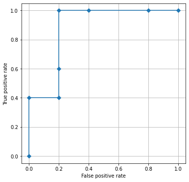

# Understanding ROC - analysis

- [Understanding ROC - analysis](#understanding-roc---analysis)
  - [Error matrix](#error-matrix)
  - [ROC-curve construction](#roc-curve-construction)
  - [Sensitivity and specificity](#sensitivity-and-specificity)
  - [Area under curve (AUC)](#area-under-curve-auc)
  - [Optimal splitting threshold using the Youden index](#optimal-splitting-threshold-using-the-youden-index)
    - [Results](#results)


## Error matrix

Let's imagine that we have 2 certain conditional classes: A and B, or healthy and sick, or 0 and 1. Moreover, let's imagine that belonging to a class is quite objective. For example, the presence / absence of deep vein thrombosis of the lower leg.

We have a group of patients that we are trying to classify into groups.

When we comprehensively examine patients and find thrombosis, the patient falls into class 1. If there is no thrombosis, the patient falls into class 0.

Next, imagine that we have come up with a new screening method that allows us to detect the presence / absence of thrombosis in a patient in 10 seconds using a smartphone.

We need to confirm that our method:

- works (is able to somehow distinguish healthy from sick);
- works well (demonstrates a low number of false positive and false negative results)

Our task is to test how the new method handles classification. To do this, we test how well the method diagnoses thrombosis (true-positive) and how well it rules out thrombosis in patients without it (true-negative).

As a result, we can compile just such a contingency table, which is called *error matrix* or *confusion matrix/ error matrix*.
| | Predicted values 1 | Predicted values 0 |
| ---------------------- | ---------------------------------- | ------------------------------------ |
| **Real values 1** | True Positives (TP) | False Negatives (FN) |
| **Real values 0** | False Positives (FP) | True Negatives (TN) |

If the new test does a good job of both confirming the diagnosis and excluding the diagnosis, the TP and TN values will be high, and the FP and FN values will be low. These tests are almost perfect.

If the test confirms the diagnosis well, but excludes it poorly, then TP and FN will be high, and TN and FP will be low.

Tests that rule out the diagnosis well but confirm poorly have high TN and FP, and low TP and FN.

There are a number of parameters associated with the error matrix that we can learn about the new test:

- Sensitivity (sensitivity, recall, true positive rate (TPR)):

$TPR = \frac {\mathrm{TP}} {\mathrm{TP}+\mathrm{FN}}= 1 - \mathrm{FNR}$

- Specificity (specificity, selectivity, true negative rate (TNR)):

$TNR = \frac {\mathrm{TN}} {\mathrm{TN} + \mathrm{FP}} = 1 - \mathrm{FPR}$

- Positive predictive value (precision, positive predictive value):

$PPV = \frac {\mathrm{TP}} {\mathrm{TP} + \mathrm{FP}} = 1 - \mathrm{FDR}$

- Negative predictive value:

$NPV = \frac {\mathrm{TN}} {\mathrm{TN} + \mathrm{FN}} = 1 - \mathrm{FOR}$

- Frequency of false negative values (false negative rate):

$FNR = \frac {\mathrm{FN}} {\mathrm{FN} + \mathrm{TP}} = 1 - \mathrm{TPR}$

- False positive rate:

$FPR = \frac {\mathrm{FP}} {\mathrm{FP} + \mathrm{TN}} = 1 - \mathrm{TNR}$

- false discovery rate (FDR):

$FDR = \frac {\mathrm{FP}} {\mathrm{FP} + \mathrm{TP}} = 1 - \mathrm{PPV}$

- false commission rate (FOR):

$FOR = \frac {\mathrm{FN}} {\mathrm{FN} + \mathrm{TN}} = 1 - \mathrm{NPV}$

- Positive likelihood ratio (LR+):

$LR+ = \frac {\mathrm{TPR}} {\mathrm{FPR}}$

- Negative likelihood ratio (LR-):

$LR- = \frac {\mathrm{FNR}} {\mathrm{TNR}}$

- Accuracy:

$ACC = \frac {\mathrm{TP} + \mathrm{TN)) {\mathrm{TP} + \mathrm{TN} + \mathrm{FP} + \mathrm{FN))$

- corrected accuracy (balanced accuracy (BA)):

$BA = \frac {TPR + TNR}{2}$

- F1 score - harmonic mean between PPV and TPR:

$F_1 = 2 \times \frac {\mathrm{PPV} \times \mathrm{TPR)) {\mathrm{PPV} + \mathrm{TPR)) = \frac {2 \mathrm{TP)) {2 \mathrm {TP} + \mathrm{FP} + \mathrm{FN}}$

- Matthews correlation coefficient (MCC):

$MCC = \frac{ \mathrm{TP} \times \mathrm{TN} - \mathrm{FP} \times \mathrm{FN} } {\sqrt{ (\mathrm{TP}+\mathrm{FP}) ( \mathrm{TP} + \mathrm{FN} ) ( \mathrm{TN} + \mathrm{FP} ) ( \mathrm{TN} + \mathrm{FN} ) }}$

We often use these indicators for:

- assessment of the qualities of a diagnostic test with objective belonging to classes (as in the conditions above);

- assessment of the qualities of a new diagnostic test in relation to the "gold standard" (in this case, we accept the hypothesis that the "gold standard" is an objective classifier).

The so-called error matrix is directly related to the so-called. *error curve* or ROC curve (receiver operating characteristic).

## ROC-curve construction

ROC-analysis allows you to evaluate the quality of a binary classification, as well as determine the optimal threshold for dividing a certain array of values into classes (for example, to determine the threshold values of diagnostic tests, etc.).

Let's try to build such a curve and figure out how this method works.

Imagine, for simplicity, that we have a certain disease that we detect in 10 patients. We know in advance whether the patient is sick (class 1) or healthy (class 0). We take a blood sample and examine the value of a certain marker V in each patient.

Thus, each patient belongs to a specific class (**classes** array) and has a marker value V (**V values** array):

| Patient number | 1 | 2 | 3 | 4 | 5 | 6 | 7 | 8 | 9 | 10 |
| ------------- | ---- | ---- | ---- | ---- | ---- | ---- | ---- | ---- | ---- | ---- |
| v values | 3 | 1 | 3 | 5 | 4 | 5 | 9 | 8 | 9 | 6 |
| classes | 0 | 0 | 0 | 1 | 0 | 1 | 1 | 0 | 1 | 1 |

Sort both arrays so that the set of real values is in ascending order:

**Expression 1. Sorted real array and corresponding class values.**

$\begin{cases} V\ values:[9, 9, 8, 6, 5, 5, 4, 3, 3, 1] \\ classes:\ \ \ [1, 1, 0, 1, 1, 1 , 0, 0, 0, 0] \end{cases}$

An ROC curve is a curve on a coordinate plane where the x-axis is FPR from the equations above and the y-axis is TPR.

Where do we get the FPR and TPR values from?

Let's do the following manipulation. Let's evaluate what *unique* values are in the **V values** array: $\{1,3,4,5,6,8,9\}$.

Sort *unique* values from the array in ascending order $\{9,8,6,5,4,3,1\}$. Each unique value $i$ from such an array must become a *threshold*: values above or equal to the threshold $i$ become class 1, values below the threshold $i$ become class 0 (see Table 1). After that, we substitute *binary values of the new classes, taking into account the thresholds*, into the sorted array **V values** from expression 1:

**Table 1. Introduction of thresholds with sorting.**

| Threshold $i$ | Sorted in descending *unique* values of the array V values | Sorted in descending order *all available* values of the array V values |
| ------------- | -------------------------------------------------- ---------- | -------------------------------------------------- ----- |
| No threshold | [9,8,6,5,4,3,1] | [9, 9, 8, 6, 5, 5, 4, 3, 3, 1] |
| Threshold 9 and above | [1,0,0,0,0,0,0] | [1,1,0, 0,0,0,0,0,0,0] |
| Threshold 8 and above | [1,1,0,0,0,0,0] | [1, 1, 1, 0,0,0,0,0,0,0] |
| Threshold 6 and above | [1,1,1,0,0,0,0] | [1,1,1,1, 0,0,0,0,0,0] |
| ... | | |
| Threshold 4 and above | [1,1,1,1,1,0,0] | [1,1,1,1,1,1,1, 0,0,0] |
| ... | | |


Now, for each $i$ threshold, replace the values of the **values** array in **Expression 1** with the corresponding values from the rightmost column of **table 1**.

For example, for the threshold "**9 and above**":


| Patient number | 7 | 9 | 8 | 10 | 6 | 4 | 5 | 1 | 3 | 2 |
| --------------------- | ---- | ---- | ---- | ---- | ---- | ---- | ---- | ---- | ---- | ---- |
| V values greater than or equal to 9 | 1 | 1 | 0 | 0 | 0 | 0 | 0 | 0 | 0 | 0 |
| classes | 1 | 1 | 0 | 1 | 1 | 1 | 0 | 0 | 0 | 0 |


When the real class and V-values match, we have true positive values (patients 7 and 9). Where both values are 0 - true negative values (in patients 8,5,1,3,2). If the real class value is 1 and V-values is 0, this value is a false negative. If the real class value is 0 and V-values is 1, this value is a false positive. Truth and falsity, as we noticed, are expressed in relation to V-values (similar to the example with the new diagnostic test in the error matrix section).
Compile *error matrix* for threshold 9 and above, and then calculate FPR and TPR:

| | V values: values 1 (predicted) | V values: values 0 (predicted) |
| ---------------------------------- | -------------------------------------- | ------------------------------------ |
| **Classes: values 1**(real) | True Positives (TP) = 2 | False Negatives (FN) = 3 |
| **Classes: values 0**(real) | False positives (FP) = 0 | True Negatives (TN) = 5 |

From here we calculate:

$TPR = \frac {2}{2+3} = 0.4$

$FPR = \frac {0}{0+5} = 0$

Then we repeat this operation for each threshold.

As a result, we will get the FPR and TPR values, which are the coordinates for each threshold for constructing the ROC curve, see Table 2. Our task is to plot the coordinate points on the plane and connect them with a line. We always start from a point with coordinates (0,0), then we connect the points from the largest threshold to the smallest with a line, and we arrive at a point with coordinates (1,1):

**Table 2. Coordinates for plotting the ROC curve.**

| | FPR (X axis) | TPR (Y axis) |
| --------------- | ----------- | ----------- |
| Starting point | 0 | 0 |
| Threshold 9 and above | 0 | 0.4 |
| Threshold 8 and above | 0.2 | 0.4 |
| Threshold 6 and above | 0.2 | 0.6 |
| Threshold 5 and above | 0.2 | 1 |
| Threshold 4 and above | 0.4 | 1 |
| Threshold 3 and above | 0.8 | 1 |
| Threshold 1 and above | 1 | 1 |
| End point | 1 | 1 |

We get the graph:



Here we have built our first ROC curve!

## Sensitivity and specificity

It is important to understand that each point on the curve will have its own sensitivity and specificity, depending on which threshold we take.

For example, if we need a sensitivity of 0.6, then it corresponds to a threshold with a value of "**6 and above**" in **Table 2**, the specificity for such a threshold would be 1 - FPR = 1 - 0.2 = 0.8.

## Area under curve (AUC)

There are several ways to calculate the area under a curve.

The simplest is to consider the resulting figure as a polygon, several polygons stacked together.

For our curve, we can simply calculate the number of "squares" of the coordinate grid (scale division 0.2) under the ROC curve and divide by the total number of graph squares:

$AUC = \frac{22}{25} = 0.88$

However, with large data arrays, manual calculation is meaningless.

One solution is to integrate using the [trapezoidal method](https://en.wikipedia.org/wiki/Trapezoidal_rule).

With the TPR and FPR arrays calculated, we can very quickly calculate the AUC using this method:

```python
import numpy as np

fpr = np.array([0, 0, 0.2, 0.2, 0.2, 0.4, 0.8, 1])
tpr = np.array([0, 0.4, 0.4, 0.6, 1, 1, 1, 1])

print(np.trapz(tpr, fpr))

>>> 0.88
```

It is also possible to calculate the AUC using the Riemann method[^1], [^2]

[^1]: [Wikipedia](https://en.wikipedia.org/wiki/Riemann_sum)
[^2]: [Riemann sum with python code](https://personal.math.ubc.ca/~pwalls/math-python/integration/riemann-sums/)

## Optimal splitting threshold using the Youden index

There are several different ways to determine the optimal threshold for classifying the vector **V values**.

One of them is the calculation of the Youden's J statistic *for each point* on which we built the ROC curve.

The Youden index is easy to calculate using the formula

$J = TPR + TNR - 1 = TPR + (1 - FPR) - 1 = TPR - FPR$

Graphically on a grid, Youden's J statistic looks like this for a threshold of 4 and above:


The threshold with the highest Youden index can be used when looking for the optimal partitioning of **V values** array values to create binary classes.

Let's calculate the Youden indices for our ROC-curve:

**Table 3. Youden indices for the constructed ROC curve.**

| | FPR (X axis) | TPR (Y axis) | Youden's J |
| --------------- | ----------- | ----------- | ---------- |
| Starting point | 0 | 0 | 0 |
| Threshold 9 and above | 0 | 0.4 | 0.4 |
| Threshold 8 and above | 0.2 | 0.4 | 0.2 |
| Threshold 6 and above | 0.2 | 0.6 | 0.4 |
| Threshold 5 and above | 0.2 | 1 | 0.8 |
| Threshold 4 and above | 0.4 | 1 | 0.6 |
| Threshold 3 and above | 0.8 | 1 | 0.2 |
| Threshold 1 and above | 1 | 1 | 0 |
| End point | 1 | 1 | 0 |

Thus, the optimal splitting threshold for the **V values** array is a threshold of 5 and above.

Numerous articles usually indicate a certain AUC indicator, as well as TPR, TNR, PPV, NPV for it, and one might get the impression that these indicators are associated with the entire curve. However, this is not true! Most often, unless otherwise stated, these characteristics are indicated just for the point with the highest Youden index.

### Results

Thus, we built an ROC curve for a small array, understood how to calculate the area under it in different ways, and also learned how to determine the theoretical best threshold for dividing an array into classes.