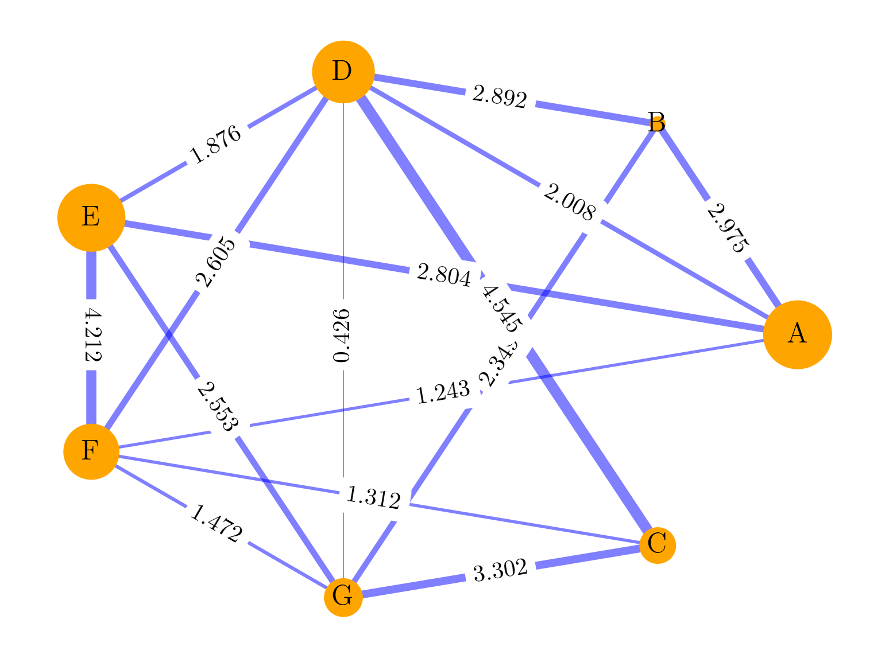
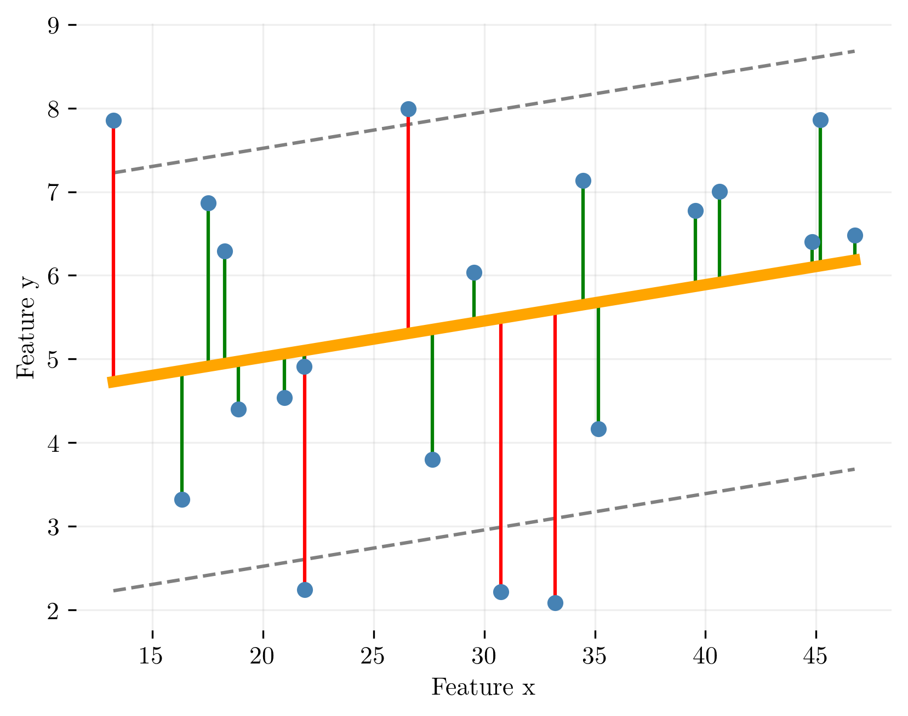
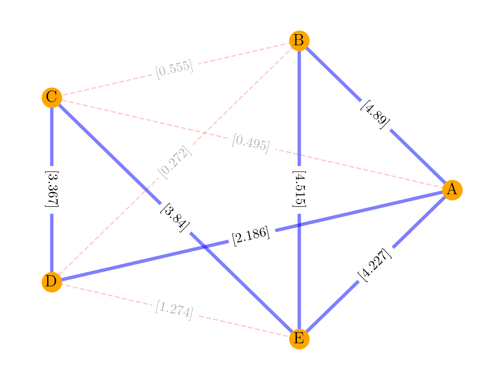
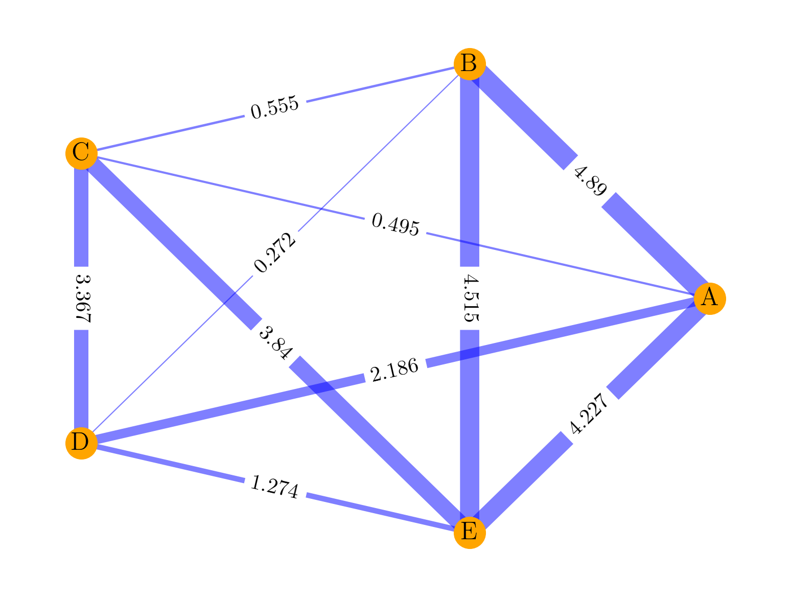
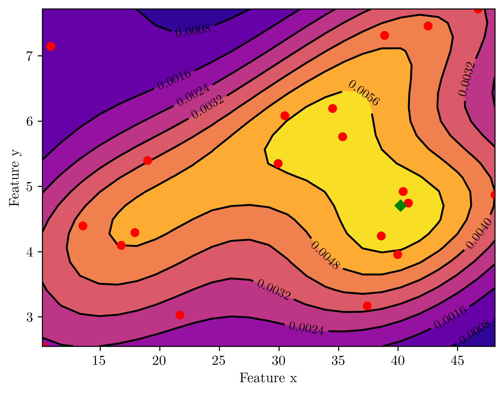
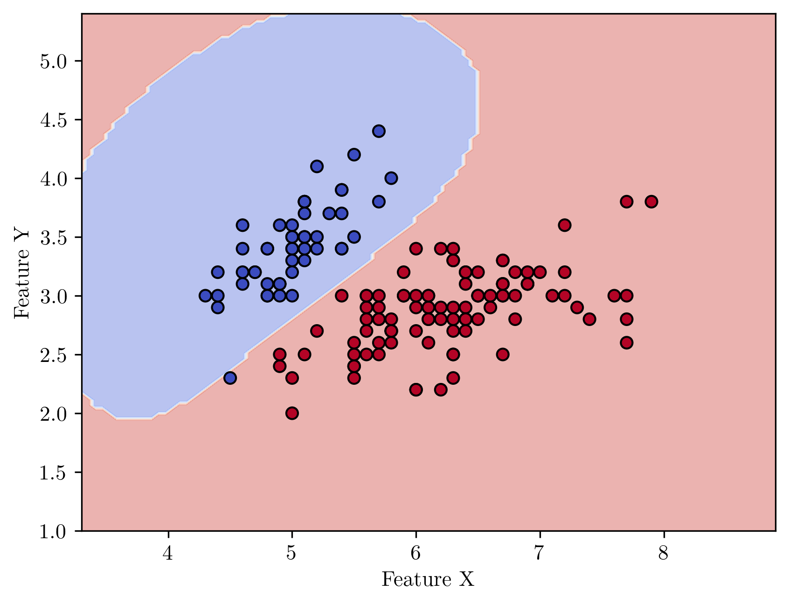
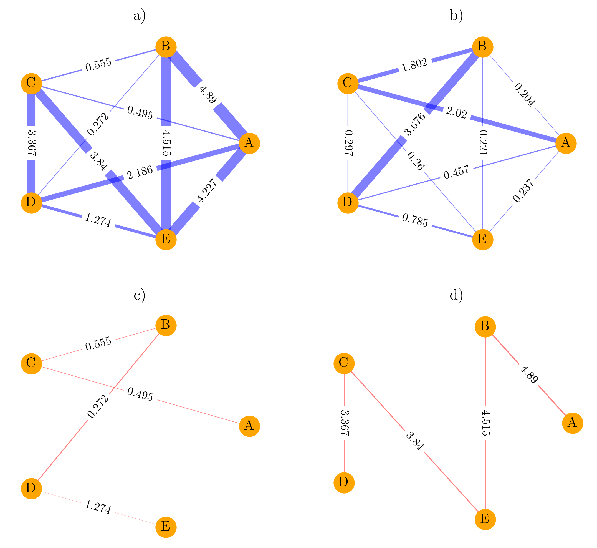

<!-- <link rel="stylesheet" href="https://unpkg.com/latex.css/style.min.css" /> -->

<!-- pandoc --citeproc -s Main_text_body.md -o 123.docx -->

<!-- About styles
https://bookdown.org/yihui/rmarkdown-cookbook/bibliography.html

Styles repository
https://www.zotero.org/styles?q=AMA -->

<!-- 
Video by some guy
https://www.youtube.com/watch?v=J86Pm62XM_Q -->

<!-- Статьи ребят: -->

<!-- Демичев - подход с бинарными переменными
https://www.medrxiv.org/content/10.1101/2021.06.24.21259374v1.full.pdf
Коды Демичесва: https://www.medrxiv.org/content/10.1101/2021.06.24.21259374v1.supplementary-material -->

## Dynamic and thermodynamic models of adaptation

  

## Abstract

### Key words

## Introduction

Теория графов позволила по-другому взглянуть на живые организмы и протекание биологических процессов. В отличие от простых моделей, описывающих конкретные процессы, сетевой анализ позволяет учесть множество взаимодействующих между собой факторов или характеристик. Такие характеристики можно представить в качестве узлов графа, который будет отражать ту или иную систему (организм, клетка, популяция и т.д., то есть, некая экспериментальная единица, представляющая для нас интерес). 

Факторы неким образом взаимодействуют между собой и характер их взаимодействия возможно неким образом оценить. Такая оценка может быть представлена, как атрибут или вес ребра между факторами-узлами.

Безусловно, в биологических процессах и живых системах характеристики протекающих процессов крайне изменчивы и имеют сложные распределения. Таким образом, представляется крайне сложным определить некие модели, описывающие взаимодействия между характеристиками и оценивающие вес самих факторов-узлов. Такие модели должны быть крайне сложными и нелинейными. Выбор конкретных моделей может быть осуществлен эмпирически. 

Более того, сетевой анализ позволяет еще и динамически оценивать системы, как изменения во времени структуры графа и его характеристик, что еще более приближает данный вид анализа к реалистичному описанию биологических систем. При оценке динамических колебаний в таких структурах перспективными напрвавлениями являются оценка реакций систем на какие-либо внешние раздражители, оценка адаптации, кризисных ситуаций и полной дезадаптации систем. 

## Materials

Сегодня существует огромное количество различных моделей и подходов, позволяющих представить ту или иную биологическую экспериментальную единицу в виде сети из основных характеристик. В настоящей статье мы остановимся на некоторых из них, для того, чтобы базовые представления о том, как формируются и оцениваются взаимодействия между факторами, что позволит использовать подход, связанный с сетевым анализом в описательных и прогностических моделях. 

### Модель биологической системы

Наиболее важным есть и остается вопрос о выборе наиболее репрезентативной описательной модели взаимосвязей в графе. Ниже на графике представлен некий взвешенный граф $G$ имеющий $V$ узлов и $E$ ребер. 

Узлы являются характеристиками экспериментальной единицы. Они могут иметь ранжирование, и тогда их вес будет различаться (на графике узлы с разным весом имеют разный размер). Веса ребер характеризуют некую оценку взаимосвязей между узлами. толщина ребер на графике пропорциональна весу. Связь может и полностью отсутствовать (на графике - узлы A и C, A и G), тогда ребро не строится. 

**Figure 1.** Пример взвешенного графа. Вершины и ребра имеют размер и толщину в зависимости от их весов. 

Теоретически, граф может быть и направленным, что, в определенных ситуациях, может повысить реалистичность модели. 

Принципиальным вопросом является выбор той системы, которую мы рассматриваем в виде сети. 

Такими системами могут быть: 

1. Некие индивидуальные экспериментальные единицы одного множества (пациенты, колонии бактерий, лабораторные животные, белковые системы и т.д.) - в таком случае, граф и будет представлять такую единицу. Все остальные единицы должны иметь сходный набор характеристик, различия же будут отмечаться лишь по весам вершин и ребер;

2. Одна единственная система, свойства которой динамически меняются во времени. В таком случае, ее состояния в различных временных точках могут быть представлены в виде графов. Такие сети также должны иметь сходный набор характеристик (узлы), чьи веса и взаимные связи (атрибуты ребер) меняются со временем;

3. Некие индивидуальные экспериментальные единицы одного множества, свойства которого меняются со временем. Таким образом, будет получен набор графов, характеризующий каждую индивидуальную экспериментальную единицу, как в случае (1), а также для каждой такой единицы с учетом временных точек возможно будет построить динамические графы, как в случае (2). 

## Методы

Существуют несколько логических этапов, связанных с построением графов для экспериментальных единиц:

1. Выбор задач по работе с системой, которую мы хотим представить в виде сети - будет ли это задача классификации или оценка динамических изменений и т.д.? Данный этап предваряет выбор соответствующей модели, которая может быть выбрана для расчета атрибутов ребер. Так, анализ динамических изменений в системе указывает на выбор корреляционной модели. Задача классификации скорее связана с выбором иных типов моделей; 
2. Предварительная трансформация данных;
3. Определение характеристик, которые будут являться узлами будущего графа;
4. Выбор модели и метода, который позволит оценить вес ребер;
5. Построение графа;
6. Далее мы можем пойти одним из двух путей: 

   - Расчет ряда показателей для каждого графа и последующая работа с этими  показателями, как с новыми характеристиками экспериментальной единицы. Мы затем можем трансформировать данные и отправить их на обучение некоего классификатора (алгоритм машинного обучения, нейронная сеть и т.д.);

   - Отправка целого графа или массива из графов для обучения в графовую нейронную сеть (GNN).

### Присвоение веса ребрам

Если говорить о моделях, работающих на уровне биохимических показателей, иммунологических реакций, описывающих генетические полиморфизмы и т.д. - подавляющее большинство характеристик экспериментальной единицы являются количественными. При рассмотрении пациента в рамках экспериментальной единицы, его истори заболевания и результатов обследований, других характеристик, большая часть из них являются качественными. 

В основе расчета веса ребра обычно используется какой-либо рассчитанный показатель модели, оценивающей связь между характеристиками. Наиболее простой вариант подразумевает, что единый тип модели используется для оценки всех попарных связей между характеристиками. В настоящей статье мы рассмотрим различные показатели: это может быть величина ошибки в линейной регрессии[@Zanin2011Sep],[@Nazarenko2021Oct], рассчитанная вероятность принадлежности к классу[@Krivonosov2022Jan], корреляция[@Gorban2009May], либо что-то иное. Таким образом очевидно, что тип модели, используемый для расчета весов, должен быть как можно более универсальным и работать с различными типами отношений, в том числе и с нелийнеными. 

Можно выделить три основных подхода к присвоению веса ребру:

- прямое присвоение веса каждому ребру, в результате чего мы получаем взвешенный граф;
- построение ребра при условии, что рассчитанный показатель выше или ниже определенного порога. Ребро строится, а величина веса соответствует 1. В таком случае, необходимо установить некую величину порога. Порог может быть известен, но может быть и определен эмпирически;
- комбинация обоих предшествующих подходов: ребро строится при условии, что рассчитанный показатель выше порога, при этом вес ребра соответствует расчитанному показателю. Если величина рассчитанного показателя не превышает порог, ребро отсутствует. 

Исходя из этих подходов, ниже будут рассмотрены методы построения наиболее изученных моделей, которые уже неоднократно были использованы в экспериментальных исследованиях:

- паренклитические графы с использованием порога[@Zanin2011Sep];
- взвешенные паренклитические графы[@Nazarenko2021Oct], [@Whitwell2018Apr];
- взвешенные синолитические графы[@Krivonosov2022Jan];
- корреляционные графы с использованием порога[@Gorban2009May];
- взвешенные корреляционные графы[@Gorban2009May].

Рассмотрим детально процесс построения различных каждого типа графов.

### Основные методы построения графов

#### Паренклитические сети с использованием линейной модели и порога (tLRPA)
<!-- https://sci-hub.ru/10.1063/1.3608126 -->

Паренклитический подход допускает гипотезу о том, что между характеристиками, которыми обладают нормальные или "здоровые" единицы некоего множества существует линейная взаимосвязь. Процесс расчета веса ребер опирается на уравнение линейной регрессии. Рассмотрим пошаговый процесс подробнее.  

1. Определяются экспериментальные единицы, которые являются контрольной группой - данная группа представляет множество "здоровых" или "нормальных" единиц. 
   
1. Определяются характеристики, которые будут являться вершинами графа, например, {А, В, С}. Затем определяются попарные комбинации без повторений между характеристиками единицы: {A-B; A-C; B-C}. Для дальнейшего построения графов и работы с ними важно, чтобы сами комбинации и порядок элементов были идентичными для всех экспериментальных единиц. 

1. Для каждой попарной комбинации характеристик ($x$, $y$) всей контрольной группы строится уравнение линейной регрессии в матричной нотации:

    $$
    \begin{equation}
    Y = X\beta_{xy} + \epsilon
    \end{equation}
    $$

    , где $\epsilon$ будет являться массивом с остатками в уравнении линейной регрессии. 

    Таким образом, для каждой пары характеристик ($x$, $y$) для $n$ - экспериментальных единиц имеется массив с отклонениями [$\epsilon_1,\ \epsilon_2,\ \epsilon_3,\ ...\ \epsilon_n$]. Так как мы знаем значение обеих характеристик, рассчитать $\epsilon_i$ можно, как:

    $$
    \begin{equation}
    \epsilon_i = \beta_{0} + \beta_{1}x_i - y_i 
    \end{equation}
    $$

1. Для группы контроля для каждой пары характеристик ($x$, $y$) также получены коэффициенты линейной регрессии $\beta_{0xy}, \beta_{1xy}$. 

1. Массивы с отклонениями преобразуются в абсолютные Z-значения, |Z-scores|:

    $$
    \begin{equation}
    abs(z_i) = \frac{|\epsilon_i - \hat{\epsilon}_{CTRL}|}{\sigma(\epsilon_{CTRL})}
    \end{equation}
    $$

    , где 

    - $i$ - экспериментальная единица,
    - $\hat{\epsilon}_{CTRL}$ - среднее отклонений $\epsilon_{1:i}$ из уравнения линейной регрессии для характеристик ($x$, $y$) по контрольной группе,
    - $\sigma(\epsilon_{CTRL})$ - стандартное отклонение значений отклонений $\epsilon_{1:i}$  по контрольной группе.
  
2. В результате, для каждой пары характеристик ($x$, $y$) мы получили уравнения линейной регрессии с коэффициентами ($\beta_{0xy}, \beta_{1xy}$). Все промежуточные этапы перед построением графов завершены. 

3. Далее мы получаем некие экспериментальные единицы, представляющие для нас интерес. Это могут быть те же единицы или какие-то новые и т.д. Мы подставляем значения характеристик этих единиц ($x_i$, $y_i$) в уже полученные уравнения линейных регрессий и для каждой экспериментальной единицы получаем свое значение $\epsilon_i$. Далее, из них мы рассчитываем абсолютные Z-scores из формулы (3). 

Линейная регрессия между характеристиками ($x$, $y$). Каждая синяя точка представляет собой экспериментальную единицу. Остатки регрессии зеленого или красного цвета. Серые линии показывают границы порога. Если нормализованные абсолютные значения остатков не превышают порог, они окрашены зеленым цветом. При превышении порога, остатки окрашены в красный цвет. 

4. Далее, из каждой экспериментальной единицы строится граф $G(V, E)$, в котором характеристики становятся совокупностью узлов $V$, а $E$ - совокупность ребер. В случае, если рассчитанное значение $abs(z_i)$ для пары узлов ($x_i$, $y_i$) больше определенного порога или равно ему, ребро строится. Если значение меньше порога, ребро отсутствует. Вес ребру не присваивается. Таким образом, единицы, напоминающие контрольную группу должны иметь небольшие отклонения $\epsilon$ и ребра выстроены не будут. В случае, если отклонение очень велико, единица отличается от контрольной группы и не подчиняется рассчитанной линейной зависимости, а ребро будет построено. 

Сложность представляет определение величины порога. В работе M.Zanin and S.Bocaletti [@Zanin2011Sep] порог был принят за $abs(z)$ = 2. 

**Figure 1.** Пример графа с пороговыми значениями гипотетической экспериментальной единицы паренклитической сети. Ребра, которым соответствует $abs(z)$ ниже порога 2, не построены (усклый красныфй пунктир). Ребра, которым соответствует $abs(z)$ выше или равный 2, построены (яркий синий цвет), при этом толщина ребер одинакова, их веса равные (равны 1). Указанные числа соответствуют не весу ребра, но рассчитанному $abs(z)$.

Толщина ребер соответствует величине веса абсолютного Z-значения между характеристиками A, B и C. 

#### Взвешенные паренклитические сети с использованием линейной модели (wLRPA)

Необходимость обосновать и вводить порог ставит большое количество вопросов. Одним из способов отказать ся от порога является построение взвешенного графа. Пошаговый процесс заключается в следующем:

1. Выполняются пункты, аналогичные 1. - 7. для паренклитического подхода с порогом. 

8. Из каждой экспериментальной единицы строится граф $G(V, E)$, в котором характеристики становятся совокупностью узлов $V$, а $E$ - совокупность ребер. При этом строятся все ребра графа, но каждому ребру присваивается вес, равный соответствующему значению абсолютного отклонения $\epsilon$. Полученные графы являются взвешенными.

**Figure 1.** Пример взвешенного графа гипотетической экспериментальной единицы паренклитической сети. Вес ребра соответствует $abs(z)$, что отраженопри отрисовки толщины ребра. 

#### Паренклитические сети с использованием оценки ядерной плотности (wKDEPA)

<!-- Инструкции по KDE здесь https://www.oncotarget.com/index.php?journal=oncotarget&page=article&op=downloadSuppFile&path%5B%5D=25216&path%5B%5D=31730 [@Whitwell2018Apr] -->

При использовании предшествующего метода с построением паренклитических графов мы допускали, что между характеристиками присутствует линейная взаимосвязь. однако в реальной ситуации такое бывает далеко не всегда, а распределение характеристик и их тип могут варьировать. Для того, чтобы преодолеть эту ситуацию, в теории можно использовать метод ядерной оценки плотности. Оценка ядерной оценки плотности возможно как для количественных, так и для категориальных переменных. На практике оценка связи между переменными различных типов различается [@Whitwell2018Apr]. Разберем отдельные этапы данного метода.  

1. Снова выделяются экспериментальные единицы, которые являются контрольной группой или группой "нормальных" единиц. Также выделяются попарные комбинации характеристик.
 
2. Для каждой комбинации характеристик ($x$, $y$) создается квадратная two dimensional kernel density matrix, получившая название контурной матрицы. Количество строк и столбцов матрицы должно превышать длину векторов $x$ и $y$, но выбирается эмпирически, с учетом количества экспериментальных единиц и вычислительной мощности. 

3. На построенной контурной матрице точка с наибольшей плотностью становится т.н. центром.

Пример контурной матрицы плотности для характеристик ($x$, $y$). Красные точки показывают отдел ные экспериментальные единицы. Центр или точка с наибольшей плотностью представлена зеленым ромбом. 

4. В общем случае, для каждой экспериментальной единицы, которая имеет координаты по характеристикам ($x$, $y$) на контурной матрице, мы вычисляем расстояние от центра матрицы до точки. Данное расстояние может быть использовано в качестве веса для данной экспериментальной единицы. 

1. Существующие подходы к вычислению весов ребер описаны в работе Whitwell, H. J. et al. [@Whitwell2018Apr] и являются экспериментальными. Имеются подходы для оценки весов в случае, если характеристики ($x$, $y$) являются количественными или одна является количественной, а другая - категориальной. Работы в этом направлении продолжаются. 

1. По аналогии с паренклитическими сетями с использованием линейной модели, может быть использован подход с непосредственным присвоением ребру рассчитанного веса (взвешенные сети approach), либо может быть использован подход с использованием порогов (threshold approach). В последнем случае величина порога должна быть установлена эмпирически. 

#### Синолитические сети (SA)

В основе синолитического подхода лежит выстраивание границы между классами с помощью того или иного классификатора. В качестве примера в литературе был рассмотрен метод опорных векторов (SVM) with the radial basis function kernel, а также логистическая регрессия [@Nazarenko2021Oct]. Однако может быть использован любой подходящий классификатор. 

Последовательность манипуляций при использовании синолитического подхода следующая:

1. Используются экспериментальные единицы, относящиеся к классам "нормальных" и "аномальных" ("здоровых" и "больных"), а не только контрольная группа целиком из "нормальных" экспериментальных единиц. Фактически, данная группа представляет собой то, что традиционно понимается под обучающими данными. 

2. Вновь определяются попарные комбинации характеристик. 
   
3. Для каждой комбинации характеристик ($x$, $y$) с помощью классификатора определяется граница, разделяющая классы. Иными словами, для каждой комбинации создается отдельный классификатор, в попытке провести границу между классами. Визуально разделение может быть представлено следующим образом.

**Figure 2.** Разделение двух классов (красные и синие) с помощью radial SVM. В связи с тем, что при синолитическом подходе используются единицы разных классов.  

4. С помощью классификатора определяется вероятность принадлежности каждой точки на плоскости ($x$, $y$) к тому или иному классу. Т.к. каждая точка обозначает отдельную экспериментальную единицу, полученные вероятности и становятся весами ребер между узлами, отражающими характеристики ($x$, $y$). Таким образом, каждая экспериментальная единица получает вес ребра между узлами ($x$, $y$).

1. Снова может иметь место два принципиальных подхода - взвешенный сеть подход, когда вес ребра является рассчитанной вероятностью или подход с использлванием порога, когда ребро будет построено в случае, если вероятность выше определенного порога. 

5. В результате, все экспериментальные единицы меняют свое представление на взвешенные графы. 

#### Корреляционные графы

Корреляционные графы наиболее часто используются при возможности получить несколько последовательных измерений одних и тех же характеристик у одной и той же экспериментальной единицы. Если у нас есть множество таких экспериментальных единиц, у нас должна быть возможность проводить одно и то же количество таких последовательных измерений, а характеристики должны быть идентичными. 

В основе такой концепции лежит гипотеза Александра Горбаня [@Gorban2009May], согласно которой в некоей системе с множеством характеристик при условии стабильности имеются некие базисные корреляции и показатели дисперсии между характеристиками $(Cor, Var)$. С течением времени происходят случайные колебания корреляции и дисперсии, но они слабо отклоняются от базисных показателей.

При условии возникновения некоего "стресса" или воздействия в системе возрастает скоррелированность характеристик, а также дисперсия $(Cor \uparrow, Var \uparrow)$. 

В дальнейшем, система либо снова возвращается к стабильности (при этом мы будем наблюдать возвращение показателей корреляции и дисперсии до базисных значений $(Cor \downarrow, Var \downarrow)$, либо наступит этап дезадаптации (или кризиса), при котором корреляции значительно снижаются (в том числе ниже уровня базисных), а дисперсия остается большой или возрастает еще больше $(Cor \downarrow, Var \uparrow)$. 

Общая инструкция для построения корреляционного графа следующая.

1. Определяем характеристики экспериментальной единицы, между которыми мы будем попарно определять корреляции, например, $(A, B, C)$. По каждой из этих характеристик мы имеем набор значений во времени, временные точки должны совпадать.

1. Исследователи выбирают начальное временное "окно", например, измерения по характеристикам на момент времени $T$ и некий эмпирический размер этого окна. Предположим, величина окна выбрана в 20 временных точек. Тогда мы получаем 19 предшествующих временных точек по каждой характеристике и измерения на момент времени $T$ (т.е., всего 20 измерений). Соответственно, для характеристик $(A, B, C)$ мы получаем по 20 временных значений с учетом $T$ для каждой экспериментальной единицы:

| Временная точка |     A     |     B     |     C     |
| :-------------: | :-------: | :-------: | :-------: |
|       $T$       |  $a_{0}$  |  $b_{0}$  |  $c_{0}$  |
|    $T_{-1}$     | $a_{-1}$  | $b_{-1}$  | $c_{-1}$  |
|    $T_{-2}$     | $a_{-2}$  | $b_{-2}$  | $c_{-2}$  |
|       ...       |    ...    |    ...    |    ...    |
|    $T_{-19}$    | $a_{-19}$ | $b_{-19}$ | $c_{-19}$ |

3. Временное окно и будет являться основой для будущего графа. Названия характеристик становятся узлами графа. Попарно между каждыми 2-мя характеристиками определяется корреляция и величина коэффициента корреляции становится атрибутом ребра между узлами. 

6. Метод оценки корреляции напрямую связан с типами подлежащих распределений характеристик и гипотез исследователей. В целом, для создания корреляционных графов могут быть использованы метод по Пирсону, по Спирману, Cramer's V, Tau и другие. 
   
7. Отдельно стоит уделить внимание значимости корреляционной связи. При отсутствии значимой корреляции логичным представляется не строить ребро между соответствующими узлами, в то время как наличие значимой корреляции позволяет построить ребро и присвоить ему вес в виде корреляционного коэффициента. Такой подход сочетает в себе элементы и взвешенных графов, и построение ребер на основании порога (в данном случае порог - уровень значимости). 

8. Таким образом, мы получили корреляционный граф на момент времени $T$. 
   
9.  Следующий этап - "переезд" окна на 1 период времени вперед - на $T_{+1}$. После чего происходит построение графа уже для этого момента времени. Порядок манипуляций аналогичен, повторяется последовательность 3. - 5. Создается новый граф для момента времени $T_{+1}$ и так далее. 

### После построения графов

Мы получаем новое представление экспериментальных единиц. Дальнейшие манипуляции сводятся к тому, что сети как структуры имеют ряд собственных характеристик.

В литературе встречаются следующие подходы к анализу данных характеристик:

- вычисление описательных статистик (минимум, максимум, среднее, дисперсия, коэффициент вариации) of the main network characteristics closeness, betweenness, edge betweenness, page rank, eigen centrality, authority score, strength, edge weights;
- вычисление количества значений "0" по каждому из этих показателей, где это возможно;
- при разумном количестве характеристик, которые являются вершинами графов - значения валентности по каждой вершине во взвешенном графе;
- вычисление описательных статистик (максимум, среднее, дисперсия) для shortest
path lengths;
- дистанции между вершинами взвешенного графа, максимальная и минимальная, среднее;
- calculation of various matrix norms for the graph, e.g. $L_1$-norm;
- calculation of number of principal components using principal component analysis with fixed value of explained variance;
- иные показатели, которые помогут максимально разделить единицы в виде графов на классы;

Другим направлением может быть анализ подграфов, например, minimal spanning trees or weight-inverted minimal spanning trees. 
Способы, которые мы обсуждали ранее, позволяют в случае подходов с порогом построить ребра графа при превышении этого самого порога, таким образом, графы, представляющие единицы, не являющиеся "нормальными" или здоровыми, будут скорее всего иметь больше ребер, чем графы "здоровых" или нормальных единиц. 

Аналогично, при использовании подхода со взвешенными графами, наибольшие значения весом должны иметь графы,  не являющиеся "нормальными" или здоровыми. Даже в случае корреляционного подхода мы ожидаем, что веса будут большими, и самих ребер будет больше за счет значимых корреляций. 

Таким образом, представляет большой интерес изучение свойств weight-inverted minimal spanning tree. Как получить такое дерево? Для каждого графа необходимо рассчитать обратные веса ребер, или $\frac{1}{w}$, а затем для такого графа построить минимальное остовное дерево, после чего пересчитать значения весов на прямые. Очевидно, что данный подход наиболее выгоден при построениии взвешенных графов, либо при комбинации взвешенного и порогового подходов. 

В weight-inverted minimal spanning tree должны остаться вершины, связанные ребрами, по которым данная экспериментальная единица наиболее отличается от "нормальных". 

**Figure 2.** a) Original weighted graph. b) Inverse-weighted graph. c) Minimal spanning tree for the original graph d) Weight-inverted minimal spanning tree.

Для таких деревьев возможны также вышеупомянутые расчеты характеристик, однако стоит помнить, что у подграфов количество вершин может отличаться от первоначального графа и от других подграфов. 

## Notes

## References
