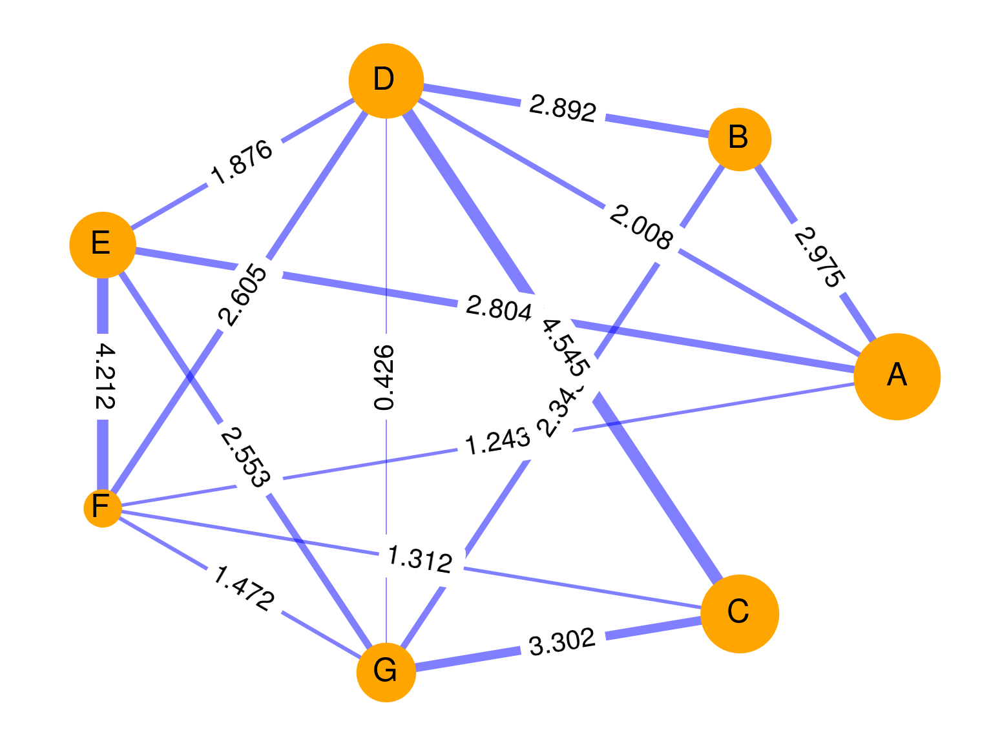
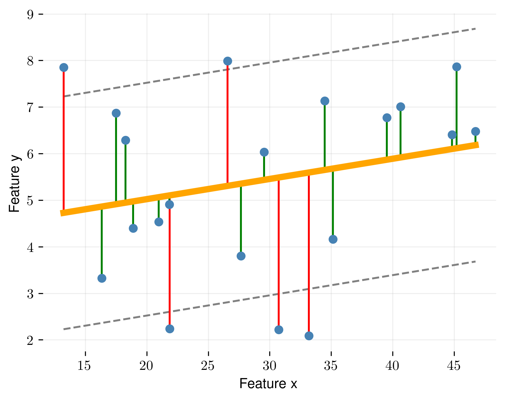
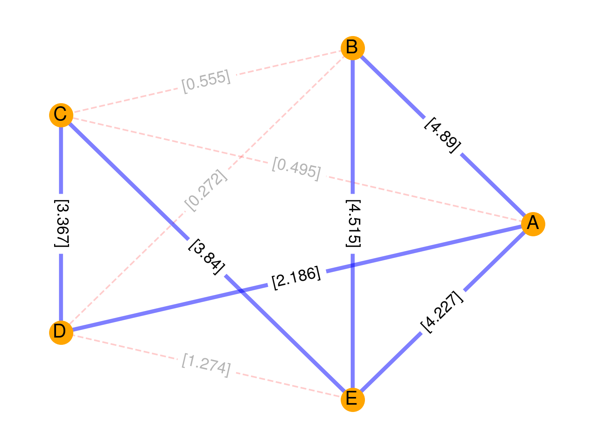
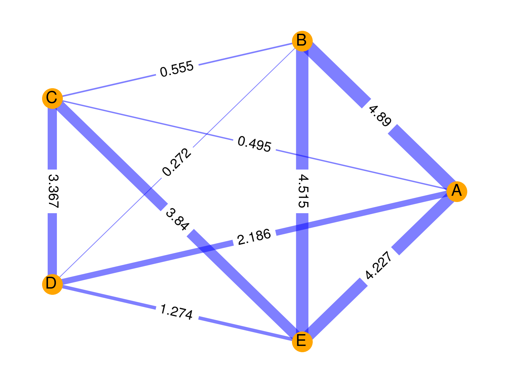
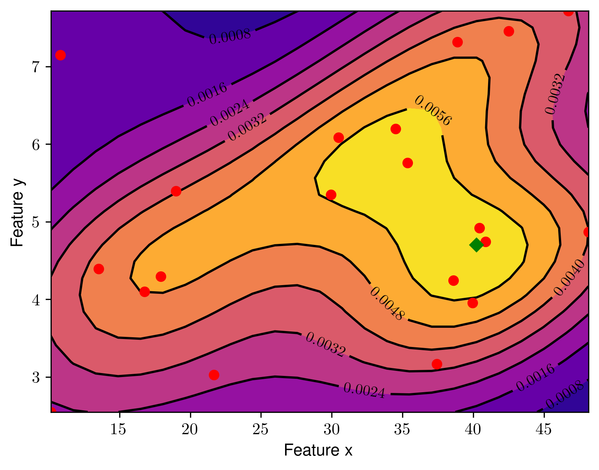
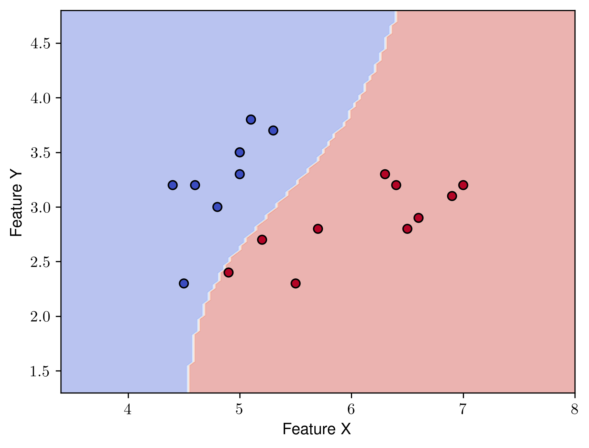
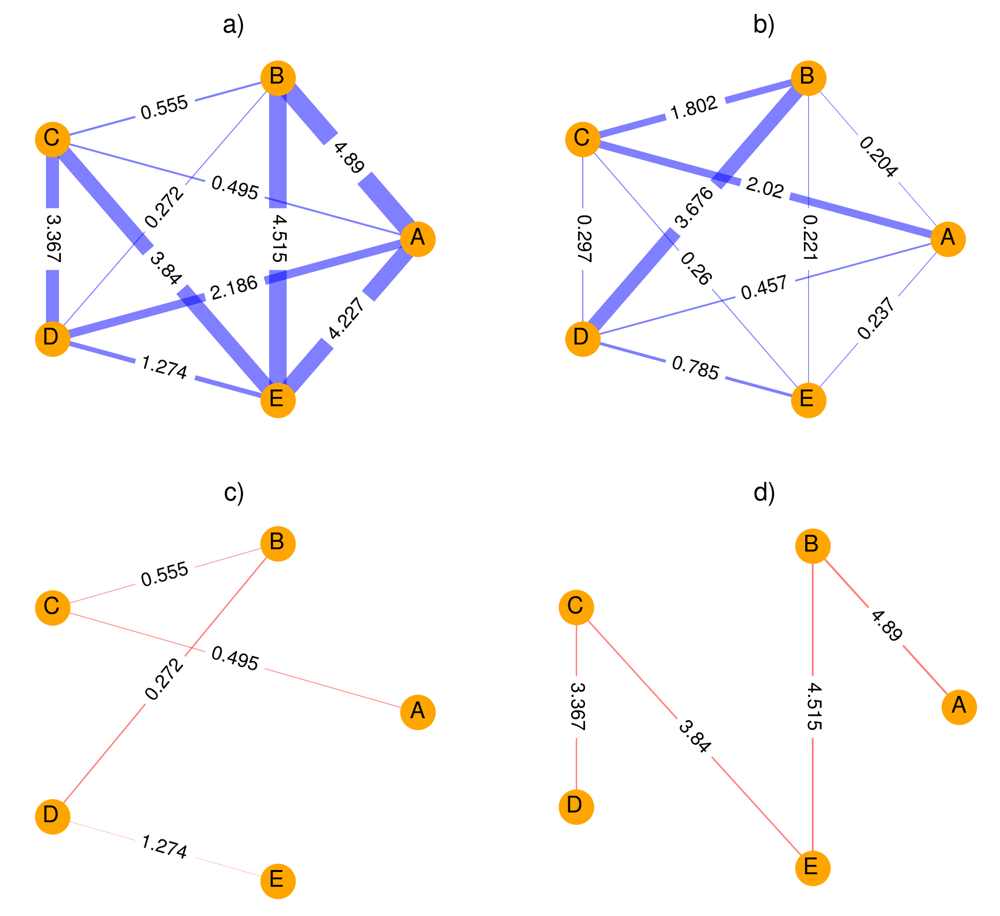

## Dynamic and thermodynamic models of adaptation

  

Overview of works [M. Zanin](https://orcid.org/0000-0002-5839-0393), [A. Gorban](https://orcid.org/0000-0001-6224-1430), [A. Zaikin](https://orcid.org/0000-0001-7540-1130), [H. Whitwell](https://orcid.org/0000-0001-8987-4158), [M. Krivonisov](https://orcid.org/0000-0002-1169-5149), [T. Nazarenko](https://orcid.org/0000-0002-4245-7346) 

by Aleksandr Suvorov

5.01.2023

## Abstract

Network analysis provides great opportunities for modelling complex biological systems. There are different approaches for modelling such systems with network and in this article we will consider some basic usefull approaches. The main idea is focused on building pipelines whrer individual units are represented as graphs. The construction of such pipelines can make it possible to solve problems of classification, regression, and analyzштп dynamic changes in biological systems. 

We will discuss common approaches for different tasks. The chapter contains the instruction for building graphs step by step focusing on the strengths and weaknesses of a particular approach.

Network analysis can become one of the leading method for building explainable artificial intelligence (AI) models. 

The method is highly perspective due to the available and wide visualization tools, as well as analytical instruments based on the topological properties of graphs.

### Key words

Networks, network analysis, graphs, machine learning, artificial intelligence, complex models, correlation, statistical modelling, classification, regression

## Introduction

Network theory made it possible to take a different look at biological systems and processes. Unlike simple models that describe specific phenomenons, network analysis allows to take into account complex interacting factors or features. Such features can be represented as graph nodes that will reflect a particular system (organism, cell, population, etc., that is, some experimental unit of interest).

Features somehow interact with each other and the nature of their interaction can be estimated in some way. Such an estimate can be represented as an attribute or weight of an edge between feature nodes.

Of course, in biological systems the features of the ongoing processes are extremely variable and may have complex distributions. Thus, it seems extremely difficult to determine some models that describe the interactions between features and estimate the weight of the factors-nodes themselves. Such models must be extremely complex and non-linear. The choice of specific models can be done empirically.

Moreover, network analysis also allows us to evaluate system dynamic changes in the structure of the graph, which brings this type of analysis even closer to a realistic description of biological systems. When assessing dynamic fluctuations in such structures, promising areas are the assessment of system reactions to any external stimuli, the assessment of adaptation, "crisis" situations and complete failure of adaptation.

## Materials

There is a great number of different models and approaches that allow one or another biological experimental unit to be represented as a network of basic features. We will focus on some of them in order to provide a basic understanding of how interactions between factors are formed and evaluated, which will allow the use of a network analysis approach in descriptive and predictive models.

### Biological system model

The most important question is of choosing the most representative descriptive model of relations in a graph. The graph below shows a weighted graph $G$ with $V$ nodes and $E$ edges.

Nodes represent features of the experimental unit. They can be ranked, and then their weight will be different (on the chart, nodes with different weights have different sizes). The edges weights characterize a certain assessment of the relations between the nodes. The thickness of the edges on the graph is proportional to the weights. The connection may be completely absent (on the graph - nodes A and C, A and G), then the edge is not built.

**Figure 1.** An example of a weighted graph. 
Vertices and edges have a size and thickness based on their weights.

Theoretically, the graph can also be directed, in certain situations this can increase the realism of the model. 

The fundamental issue is the choice of the system that we consider as a network.

Such systems can be:

1. Some individual experimental units of one set (patients, bacterial colonies, laboratory animals, protein systems, etc.) - in this case, the graph will represent such individual unit. All other units should have a similar set of features, while differences will be noted only in the weights of the edges (representing differencies in relation between unit features);

2. One single system with properties dynamically changing over time. In this case, its states at different time points can be represented as graphs. Such networks should also have a similar set of features (nodes) with interconnections (edge weights) changing over time;

3. Some individual experimental units of one set, the properties of which change over time. Thus, a set of graphs will be obtained that characterizes each individual experimental unit, as in case (1), and also for each such unit it will be possible to construct dynamic graphs, as in case (2).

## Methods

There are several steps in building graphs for experimental units:

1. The choice of the systems that we want to represent as a network and the tasks we want to solve - will it be a classification task or an assessment of dynamic changes, etc.? This step precedes the selection of an appropriate model to calculate the attributes of the edges. Thus, the analysis of dynamic changes in the system indicates the choice of a correlation model. The task of classification is rather associated with the choice of other types of models;
2. Preliminary data transformation;
3. Determining the features that will be the nodes of the future graphs;
4. Choice of a model and a method that will allow estimating the weights of the edges;
5. Transforming units into graphs;
6. Next, we can go one of two ways:

    - Calculation specific graph characterics and subsequent calculations with these characterics, as with new features of the experimental unit. We can then transform the data and send it to be trained by some classifier (machine learning algorithm, neural network, etc.);

    - Sending a whole graph or a list of graphs for training in a graph neural network (GNN).

### Assigning weights to edges

The vast majority of the features at the level of biochemical parameters, immunological reactions, genetic polymorphisms, etc. are quantitative. When considering the other levels of networks, e.g. patients as units, their medical history and examination results, most of them are qualitative.

The calculation of the edge weight is usually based on some model that evaluates the relationship between the characteristics. The simplest option implies that a single type of model can be used to evaluate all pairwise relationships between features. Various model results and indicators can be used as a relation measure: it can be the magnitude of the error in the linear regression [@Zanin2011Sep], [@Nazarenko2021Oct], the calculated probability of belonging to the class[@Krivonosov2022Jan], the correlation[@Gorban2009May], or something else. Thus, it is obvious that the type of model used to calculate the weights should be as universal as possible and describe various types of relationships, including non-linear ones.

There are three popular approaches for assigning weight to an edge:

- direct assignment of weight to the edge, as a result a weighted graph is constructed;
- construction of an edge, provided that the calculated model indicator is above or below a certain threshold. The edge is built, and the weight value corresponds to 1. In this case it is necessary to set a certain threshold value. The threshold may be known, but it may also be determined empirically;
- a combination of both previous approaches: the edge is built under the condition that the calculated indicator is above/below the threshold, while the weight of the edge corresponds to the calculated model indicator. If the value of the indicator does not exceed the threshold, the edge is absent.

Based on these approaches various methods are mentioned in the literature: 

- parenclitic graphs using threshold[@Zanin2011Sep];
- weighted parenclitic graphs[@Nazarenko2021Oct], [@Whitwell2018Apr];
- weighted sinolithic graphs[@Krivonosov2022Jan];
- correlation graphs using threshold[@Gorban2009May];
- weighted correlation graphs[@Gorban2009May].

Let us consider in detail the process of constructing various graphs of each type.

### Basic graph building methods

#### Parenclitic networks using linear model and threshold (tLRPA)

The parenclitic approach bases on the hypothesis that there is a linear relation between the features of "normal" or "healthy" units. The process of calculating the edge weights is based on a linear regression equation. Let's take a closer look at the step by step process.

1. The set of "healthy" or "normal" units is defined (control group).
   
2. The features that will be the future vertices of the graph are defined, for example, {A, B, C}. Pairwise combinations without repetitions between the features of the unit are determined: {A-B; A-C; B-C}. For further construction of graphs it is important that the combinations themselves and the order of elements are identical for all experimental units.

3. For each pairwise combination of characteristics ($x$, $y$) of the entire control group, a linear regression model is fitted:

     $$
     \begin{equation}
     Y = X\beta_{xy} + \epsilon
     \end{equation}
     $$

     , where $\epsilon$ will be an array with residuals.

     Thus, for each pair of characteristics ($x$, $y$) for $n$ experimental units, there is an array with residuals [$\epsilon_1,\ \epsilon_2,\ \epsilon_3,\ ...\ \epsilon_n$]. Since we know the value of both features, we can calculate $\epsilon_i$ as follows:

     $$
     \begin{equation}
     \epsilon_i = \beta_{0} + \beta_{1}x_i - y_i
     \end{equation}
     $$

4. For the control group, for each pair of characteristics ($x$, $y$), linear regression coefficients $\beta_{0xy}, \beta_{1xy}$ are also obtained.

5. Array with residuals is converted to absolute Z-values, |Z-scores|:

     $$
     \begin{equation}
     abs(z_i) = \frac{|\epsilon_i - \hat{\epsilon}_{CTRL}|}{\sigma(\epsilon_{CTRL})}
     \end{equation}
     $$

     , where

     - $i$ - experimental unit,
     - $\hat{\epsilon}_{CTRL}$ - mean residual $\epsilon_{1:i}$ from the linear regression equation for features ($x$, $y$) for the control group,
     - $\sigma(\epsilon_{CTRL})$ - standard deviation of $\epsilon_{1:i}$ residual values for the control group.
  
6. For each pair of characteristics ($x$, $y$) we have obtained linear regression coefficients ($\beta_{0xy}, \beta_{1xy}$). All intermediate stages before graph construction are completed.

7. Next, we get some experimental unit $i$ that is of interest to us. We substitute the values of the features ($x_i$, $y_i$) into the already obtained linear regression equations and obtain its own value $\epsilon_i$. Further,  we calculate absolute Z-score from formula (3). We repeat the prossess for every new experimental unit.

**Figure 2.** Linear regression between features ($x$, $y$). Each blue dot represents an experimental unit. The regression residuals are green or red. The gray lines show the boundaries of the threshold. If the normalized absolute values of the residuals do not exceed the threshold, they are colored green. When the threshold is exceeded, the residuals are colored red.

1. From each experimental unit, a graph $G(V, E)$ is constructed, the features become the set of nodes $V$, and $E$ - the set of edges. If the calculated value $abs(z_i)$ for a pair of nodes ($x$, $y$) is greater than or equal to a certain threshold, an edge is built. If the value is less than the threshold, there is no edge. Thus, units similar to the control group should have small $abs(z_i)$ and graphs representing theese units will have few edges. Units highly deviating from control group will have large $abs(z_i)$ and more constructed edges: if the residual is very large, the unit differs from the control group and does not obey the calculated linear relationship, and the edge will be built.

The main challenge is in the determining the threshold. In the work of M.Zanin and S.Bocaletti [@Zanin2011Sep] the threshold was taken as $abs(z)$ = 2.

**Figure 3.** An example of a graph with threshold values for a hypothetical experimental unit of a parenclitic network. Edges corresponding to $abs(z)$ below threshold 2 are not built (sharp red dotted line). Edges that correspond to $abs(z)$ greater than or equal to 2 are built (bright blue). The indicated numbers do not correspond to the weight of the edge, just to the calculated $abs(z)$.

#### Weighted parenclitic networks using linear model (wLRPA)

The need of the threshold raises large number of challenges. One way to get rid of the threshold is to build a weighted graph. The step by step process is as follows:

1. Follow the steps similar to 1. - 7. for the parenclitic approach with a threshold.

2. Since there is no threshold, all edges of the graph are constructed, but each edge is assigned a weight equal to the corresponding value of the absolute deviation $abs(z)$. The resulting graphs are weighted.

**Figure 4.** An example of a weighted graph of a hypothetical experimental unit of a parenclitic network. The weight of the edge and the edge thickness corresponds to $abs(z)$.

#### Parenclitic networks using nuclear density estimation (wKDEPA)

When using linear regression method for the construction of parenclitic graphs, we assumed that there is a linear relation between the features. However, this does not always happen, and the distribution of features is usually non-linear. Various approaches were proposed to describe both linear and non-linear relations in a single method. One of such approaches is kernel density estimation. Theoretically the approach can be used for both quantitative and categorical variables. In practice, the estimation of association between variables of different types differs [@Whitwell2018Apr]. Let's take a look at the individual steps of this method.

1. Again, control group of "normal" units is specified. Pairwise combinations of features are also produced.
 
2. For each pairwise combination of features ($x$, $y$) a square two dimensional kernel density matrix is created which is called the *contour matrix*. The number of rows and columns of the matrix must exceed the length of the vectors $x$ and $y$, but is chosen empirically, taking into account the number of experimental units and computational power.

3. On the constructed contour matrix, the point with the highest density becomes the so-called center.

**Figure 5.** An example of a contour density matrix for features ($x$, $y$). Red dots show individual experimental units. The center or point with the highest density is represented by a green diamond.

4. Generally, for each experimental unit $i$ with coordinates by features [$x_i$, $y_i$] on the contour matrix, we calculate the distance from the center of the matrix to the coordinate point. Euclidean or Mahalanobis distance are popular approaches. The distance can serve as a raw edge weight for this unit. More complex idea is to estimate the volume under the densities that are higher than the density where the point is within the distribution.

5. Different approaches for calculating edge weights depending on feature distributions are described in Whitwell, H. J. et al. [@Whitwell2018Apr] and are experimental. Work in this direction continues.

6. By analogy with parenclitic networks using a linear model, an approach with direct assignment of a calculated weight to an edge (weighted network approach) can be used, or an approach using threshold (threshold approach) can be used. In the latter case the threshold value must be established empirically.

#### Synolytic networks (SA)

The synolytic approach is based on constructing the boundary between classes with the help of some classifier. The boundary must provide best separation between "normal" and "unnormal" units. For every pair of unit features a classifier is fitted to build such boundary and to relate the unit to one class or to another. The approach uses units both from "normal" and "unnormal" sets. In literature support vector machine (SVM) with the radial basis function kernel [@Krivonosov2022Jan], as well as logistic regression [@Nazarenko2021Oct], have been considered. However any suitable classifier may be used.

The sequence of manipulations when using the sinolytic approach is as follows:

1. Experimental units belonging to "normal" and "abnormal" classes are used. Pairwise feature combinations are determined again.
   
2. For each combination of features ($x$, $y$), a classifier is used to construct the boundary that separates the classes. In other words, a separate classifier is created for each combination, in an attempt to draw a line or a curve between classes. 

**Figure 6.** Separation of two classes (red and blue) using radial SVM. 

3. The classifier gives the probability of belonging of each unit to one class or another. The resulting probabilities become the weights of the edges between nodes($x$, $y$). Thus, each experimental unit receives the weight of an edge between nodes ($x$, $y$).

4. Again, two principal approaches can take place - a network-weighted approach, where the weight of an edge is a calculated probability, or a thresholding approach, where an edge will be built if the probability is above a certain threshold.

5. As a result, all experimental units change their representation to weighted graphs.

#### Correlation graphs and networks

Correlation graphs are most often used when it is possible to obtain several consecutive measurements of the same features from the unit. If we have many such experimental units, we should be able to make the same number of such consecutive measurements, and the characteristics should be identical.

This concept is based on the hypothesis of Alexander Gorban [@Gorban2009May], according to which in a certain system with many features under the condition of stability there are certain baseline correlations and variance $(Cor, Var)$. Over time random fluctuations in correlations and variance occur but they deviate slightly from the baseline.

Under the condition of a certain "stress" or influence on the system, the correlation of features drastically increases, as well as the variance $(Cor \uparrow, Var \uparrow)$.

In the future the system either returns to stable state again (in this case we will observe the return of correlation and variance to baseline $(Cor \downarrow, Var \downarrow)$) or complete disadaptation (or crisis) will come, at which correlations are significantly reduced (including those below the baseline level), while the variance remains large or increases even more $(Cor \downarrow, Var \uparrow)$.

The general steps for constructing a correlation graph are as follows:

1. We determine the features of the experimental unit that are changing over time, for example, $(A, B, C)$. 

2. Researchers choose an initial "time window", for example, measurements at time $T$ and some empirical size of this window. Suppose the window size is chosen to be 20 time points. Then we get 19 previous time points and time $T$ for each feature measurements (i.e., 20 measurements in total):

| Time point |     A     |     b     |     c     |
| :--------: | :-------: | :-------: | :-------: |
|    $T$     |  $a_{0}$  |  $b_{0}$  |  $c_{0}$  |
|  $T_{-1}$  | $a_{-1}$  | $b_{-1}$  | $c_{-1}$  |
|  $T_{-2}$  | $a_{-2}$  | $b_{-2}$  | $c_{-2}$  |
|    ...     |    ...    |    ...    |    ...    |
| $T_{-19}$  | $a_{-19}$ | $b_{-19}$ | $c_{-19}$ |

1. The time window with features will be the basis for the future graph. The names of the features become the nodes of the graph. Next we calculate pairwise correlations between all the features. The correlation coefficient becomes the edge weight between the nodes.

2. The method of estimating the correlation is directly related to the types of underlying distributions of characteristics and hypotheses of researchers. In general, the Pearson, Spearman, Cramer's V, Tau and others methods can be used to create correlation graphs.
   
3. It is worth paying attention to the significance of the correlation. In the absence of a significant correlation, it seems logical not to build an edge between the corresponding nodes, while the presence of a significant correlation allows you to build an edge and assign weight to it. This approach combines from both weighted graphs approach and the threshold approach (in this case the threshold is the level of significance).

4. Thus, we have obtained a correlation graph at time $T$.
   
5. The next stage is to "move" the whole window forward by 1 time period - to $T_{+1}$. After that the graph is built already for this timepoint. The order of manipulations is similar, the sequence of points 3). - 5). is repeated. Similar a new graph is created for the time $T_{+1}$, "time window" moves to the enxt point  and so on.

### Further manipulations with networks

As we transformed the presentation of units into graphs, further manipulations are connected with analysing network structures of graphs.

The following approaches are found in the literature:

- calculation of descriptive statistics (minimum, maximum, mean, variance, coefficient of variation) of the main network characteristics closeness, betweenness, edge betweenness, page rank, eigen centrality, authority score, strength, edge weights;
- calculation of the number of "0" values for each of these characteristics where appropriate;
- with a reasonable number of graph vertices - raw degree values for each vertex in the weighted graph;
- calculation of descriptive statistics (maximum, mean, variance) for shortest path lengths;
- distances between the vertices of the weighted graph (maximum and minimum, average);
- calculation of various matrix norms for the graph, e.g. $L_1$-norm;
- calculation of the number of principal components using principal component analysis with fixed value of explained variance;
- other indicators that will help to separate the graphs into classes;

Another direction could be subgraph analysis, such as minimal spanning trees or weight-inverted minimal spanning trees.

The methods we discussed earlier imply that "unnormal" units will have more edges in graphs in case of threshold approach or larger edge weights in case of weighted approach. The key point is to determine the features that contribute most to the differences between "normal" and "unnormal" groups.

One of the approaches is a concept of weight-inverted minimal spanning tree. How to get such a tree? For each graph it is necessary to calculate the inverse weights of the edges, or $\frac{1}{w}$, and then build a minimum spanning tree for such a graph, next recalculate the values of the weights back. Obviously this approach is most beneficial when constructing weighted graphs, or when using a combination of weighted and threshold approaches.

The weight-inverted minimal spanning tree should contain vertices connected by edges along which the given experimental unit differs most from the "normal" ones. This can help the researches to find the features that differ mostly from the "normal" ones. This approach takes into account the multidimensional relations between the features.

**Figure 7.** a) Original weighted graph. b) Inverse-weighted graph. c) Minimal spanning tree for the original graph d) Weight-inverted minimal spanning tree.

For such trees, the above graph characteristics calculations are possible, but it is worth taking into consideration that the number of vertices for subgraphs may differ from the original graph and from other subgraphs.

## Notes

## References
