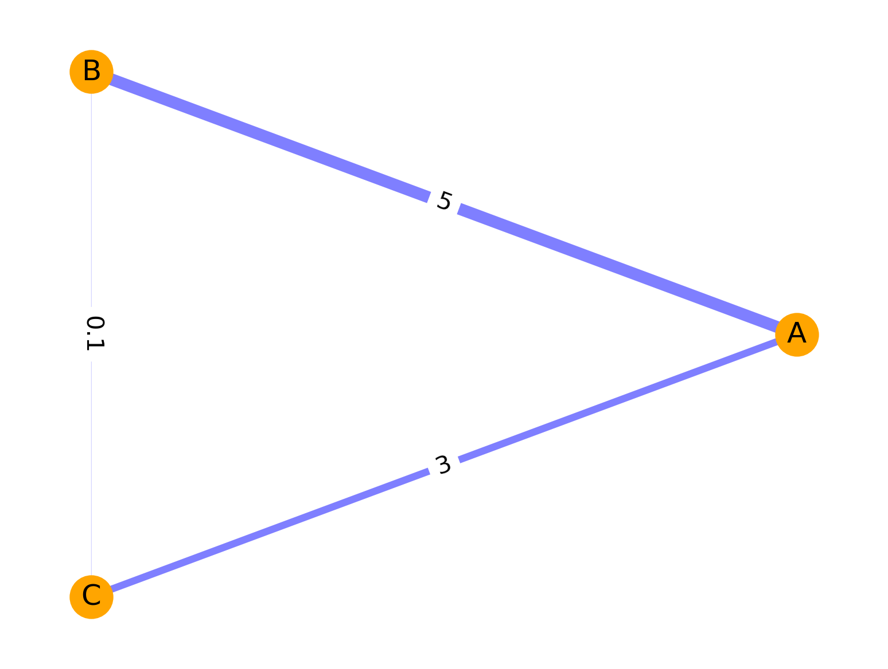

<link rel="stylesheet" href="https://unpkg.com/latex.css/style.min.css" />

<!-- pandoc --citeproc -s Main_text_body.md -o 123.docx -->

<!-- About styles
https://bookdown.org/yihui/rmarkdown-cookbook/bibliography.html

Styles repository
https://www.zotero.org/styles?q=AMA -->

<!-- 
Video by some guy
https://www.youtube.com/watch?v=J86Pm62XM_Q -->

<!-- Статьи ребят: -->

<!-- Демичев - подход с бинарными переменными
https://www.medrxiv.org/content/10.1101/2021.06.24.21259374v1.full.pdf
Коды Демичесва: https://www.medrxiv.org/content/10.1101/2021.06.24.21259374v1.supplementary-material -->

## Dynamic and thermodynamic models of adaptation

  

## Abstract

### Key words

## Introduction

Теория графов позволила по-другому взглянуть на живые организмы и протекание биологических процессов. В отличие от простых моделей, описывающих конкретные процессы, сетевой анализ позволяет учесть множество взаимодействующих факторов (узлы), их важность (вес узлов), характер их взаимодействия (упрощенно - атрибуты ребер). Более того, сетевой анализ позволяетт еще и динамически оценивать меняющиеся характеристики графа, что еще более приближает данный вид анализа к реалистичному описанию биологических систем. 

Наиболее важным есть и остается вопрос о наиболее репрезентативной описательной модели взаимосвязей в графе, который характеризует пациента. 

Если говорить о моделях, работающих на уровне биохимических показателей, иммунологических реакций, описывающих генетические полдиморфизмы и т.д. - подавляющее большинство характеристик экспериментальной единицы являются количественными. При рассмотрении пациента в рамках экспериментальной единицы, его истори заболевания и результатов обследований, других характеристик, большая часть из них уже становятся качественными. 

В настоящей главе авторы приводят протокол для моделей, описывающих взаимодействие количественных переменных. 
Мы рассмотрим методы построения наиболее изученных моделей, которые уже неоднократно были использованы в экспериментальных исследованиях:

- взвешенные паренклитические графы;
- взвешенные синолитические графы;
- корреляционные графы.

Существуют несколько логических этапов, связанных с рассмотрением экспериментальных единиц в разрезе сетевого анализа [@Krivonosov2022Jan]:

1. Предварительная трансформация данных;
2. Определение характеристик, которые будут являться узлами будущего графа;
3. Определение атрибутов ребер между узлами графа, которые будут являться весами ребер;
4. Построение взвешенного графа.

Бла-бла-бла...

## Materials

### Взвешенные паренклитические сети (wLRPA)

1. Выделяется экспериментальные единицы, которые являются контрольной группой - данная группа представляет множество "здоровых" или "нормальных" единиц. 
   
1. Выделяются попарные комбинации без повторений между характеристиками единицы. Например, при наличии 3-х характеристик единицы [А, В, С] попарные комбинации будут следующие: [A-B, A-C, B-C]. Для дальнейшего построениия графов и работы с ними важно, чтобы сами комбинации и порядок элементов были идентичными для всех экспериментальных единиц. 

1. Для каждой попарной комбинации характеристик ($x$, $y$) всей контрольной группы строится уравнение линейной регрессии:

    $$
    \begin{equation}
    y = \beta_0 + \beta_1 \times x + \epsilon
    \end{equation}
    $$

    , где 

    - $i$ - экспериментальная единица,
    - $\epsilon$ - остаток в уравнении линейной регрессии

    Таким образом, для каждой пары характеристик ($x$, $y$) имеется массив с отклонениями [$\epsilon_{x_1, y_1},\ \epsilon_{x_2, y_2},\ \epsilon_{x_3, y_3},\ ...\ \epsilon_{x_i, y_i}$], где $i$ - экспериментальная единица. 

1. Массивы с отклонениями преобразуются в абсолютные Z-значения, |Z-scores|:

    $$
    \begin{equation}
    abs(z_i) = \frac{|\epsilon_i - \hat{\epsilon}_{CTRL}|}{\sigma(\epsilon_{CTRL})}
    \end{equation}
    $$

    , где 

    - $i$ - экспериментальная единица,
    - $\hat{\epsilon}_{CTRL}$ - среднее отклонений $\epsilon_{1:i}$ из уравнения линейной регрессии для характеристик ($x$, $y$) по контрольной группе,
    - $\sigma(\epsilon_{CTRL})$ - стандартное отклонение значений отклонений $\epsilon_{1:i}$  по контрольной группе.

1. Полученные абсолютные Z-scores и становятся весами ребра между узлами ($x$, $y$).
   
1. После получения весов для каждой пары узлов по каждой экспериментальной единице строится взвешенный граф $G(V, E)$ , где V - множество узлов графа, соответствующих  характеристикам экспериментальной единицы, E - множество ребер графа, соответствующих полученным абсолютным Z-scores.

    
    **Picture 1.** Пример взвешенного графа гипотетической экспериментальной единицы паренклитической сети. Толщина ребер соответствует величине веса абсолютного Z-значения между характеристиками A, B и C. 

    - итогом является изменение представления структуры данных по каждой экспериментальной единицы, которая теперь предстает перед нами в виде сети характеристик, ассоциированных между собой.

1. Для полученного взвешенного графа могут быть рассчитаны ряд его характеристик, среди которых рекомендованными являются:

   - описательные статистики (количество нулей, минимум, максимум, среднее, стандартное отклонение и любые другие) для таких показателей графа, как closeness, betweenness, edge betweenness, page rank, eigen centrality, authority score, node degree, edge weights;
   - the vector of all nodes degrees in a graph.

1. Таким образом, осуществляется изменение и представления, и размерности уже сетевой структуры, и мы вновь имеем дело уже с табличными рядами данных, характеризующих экспериментальную единицу. 

1. Все предшествующие манипуляции проводились для контрольной группы, куда входили некие "здоровые" или "нормальные" единицы. При появлении некоей новой экспериментальной единицы или нескольких экспериментальных единиц проводимые манипуляции следующие. Для каждой новой экспериментальной единицы для каждой пары характеристик ($x$, $y$) строится уравнение линейной регрессии, но используются коэффициенты $\beta_0$ и $\beta_1$, которые были получены для контрольной группы. После этого оценивается величина $\epsilon_j$, где $j$ - новая экспериментальная единица. 

1. Полученные массивы отклонений для новых экспериментальных единиц $\epsilon_{1:j}$ нормализуются относительно среднего и стандартного отклонения для контрольной группы:

    $$
    \begin{equation}
    abs(z_j) = \frac{|\epsilon_j - \hat{\epsilon}_{CTRL}|}{\sigma(\epsilon_{CTRL})}
    \end{equation}
    $$

    , где 

    - $j$ - новая экспериментальная единица,
    - $\hat{\epsilon}_{CTRL}$ - среднее отклонений для характеристик ($x$, $y$) по контрольной группе,
    - $\sigma(\epsilon_{CTRL})$ - стандартное отклонение значений отклонений по контрольной группе.

    В результате, получены абсолютные Z-scores для новых единиц. 

1. Впоследствии для новых единиц проводятся манипуляции 5. - 7. для создания графов и вычисления их характеристик. 

### Взвешенные паренклитические сети (wKDEPA)

<!-- Инструкции по KDE здесь https://www.oncotarget.com/index.php?journal=oncotarget&page=article&op=downloadSuppFile&path%5B%5D=25216&path%5B%5D=31730 [@Whitwell2018Apr] -->

1. Снова выделяются экспериментальные единицы, которые являются контрольной группой или группой "нормальных" единиц. Также выделяются попарные комбинации характеристик, однако уже с целью построения two dimensional kernel density estimation.
 
3. Для каждой комбинации характеристик ($x$, $y$) определяется two dimensional kernel density matrix, такая матрица является квадратной. Количество строк и столбцов матрицы минимально определяется длиной векторов $x$ и $y$, при этом может быть увеличено. (Почему?)  
  
1. Далее 

бла-бла-бла

### Синолитические сети (wSA)

В основе синолитического подхода лежит выстраивание границы между классами с помощью того или иного классификатора. Хорошие результаты были продемонстрированы с помощью SVM with the radial basis function kernel [@Nazarenko2021Oct].

Последовательность манипуляций при использовании синолитического подхода следующая:

1. Используются экспериментальные единицы, относящиеся к классам "нормальных" и "аномальных" ("здоровых" и "больных"), а не только контрольная группа целиком из "нормальных" экспериментальных единиц. 

## Methods

## Notes

## References
